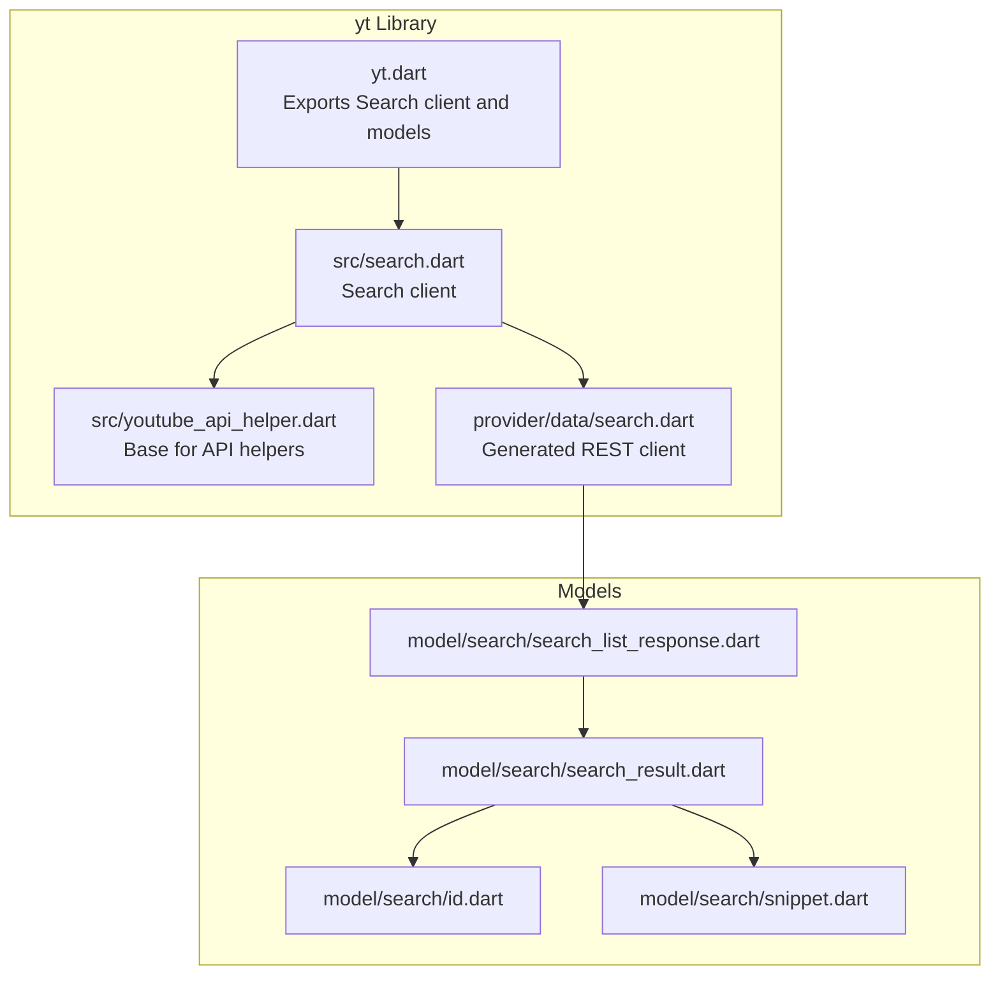
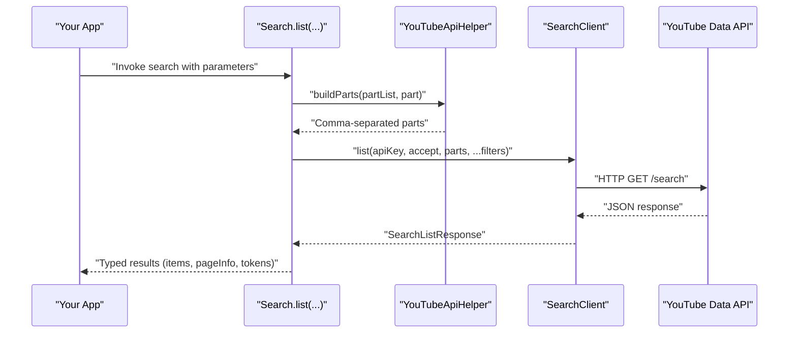
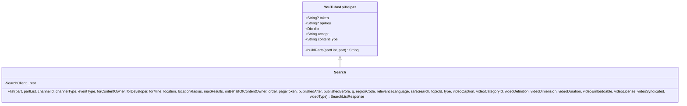
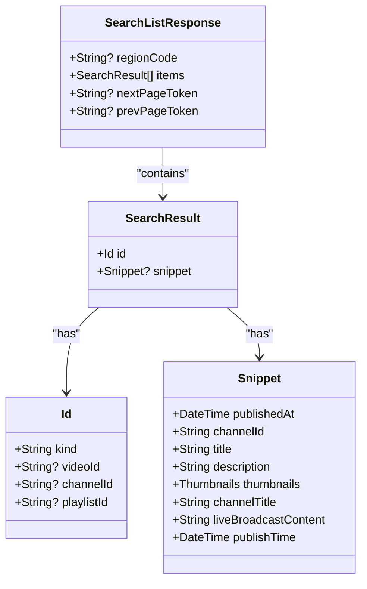
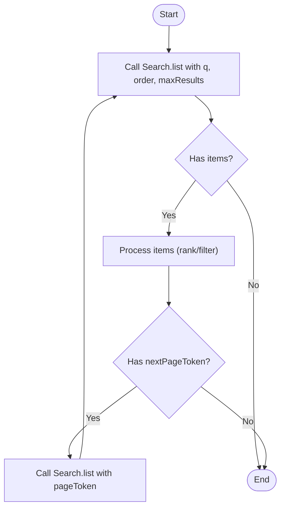
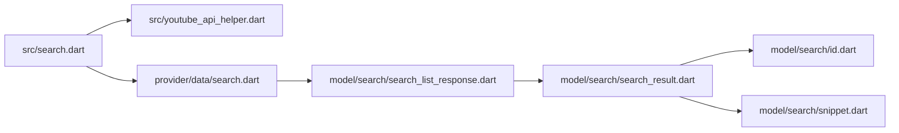

# Search & Discovery

<cite>
**Referenced Files in This Document**
- [README.md](file://README.md)
- [pubspec.yaml](file://pubspec.yaml)
- [packages/yt/README.md](file://packages/yt/README.md)
- [packages/yt/lib/yt.dart](file://packages/yt/lib/yt.dart)
- [packages/yt/lib/src/search.dart](file://packages/yt/lib/src/search.dart)
- [packages/yt/lib/src/youtube_api_helper.dart](file://packages/yt/lib/src/youtube_api_helper.dart)
- [packages/yt/lib/src/model/search/search_list_response.dart](file://packages/yt/lib/src/model/search/search_list_response.dart)
- [packages/yt/lib/src/model/search/search_result.dart](file://packages/yt/lib/src/model/search/search_result.dart)
- [packages/yt/lib/src/model/search/id.dart](file://packages/yt/lib/src/model/search/id.dart)
- [packages/yt/lib/src/model/search/snippet.dart](file://packages/yt/lib/src/model/search/snippet.dart)
</cite>

## Table of Contents
1. [Introduction](#introduction)
2. [Project Structure](#project-structure)
3. [Core Components](#core-components)
4. [Architecture Overview](#architecture-overview)
5. [Detailed Component Analysis](#detailed-component-analysis)
6. [Dependency Analysis](#dependency-analysis)
7. [Performance Considerations](#performance-considerations)
8. [Troubleshooting Guide](#troubleshooting-guide)
9. [Conclusion](#conclusion)
10. [Appendices](#appendices)

## Introduction
This document explains how to build, refine, and consume YouTube Data API search queries using the Dart/Flutter library in this repository. It focuses on constructing search queries, applying filters (content types, geographic targeting, date ranges, and quality), paginating results, and integrating with recommendation systems. It also provides guidance on analytics, trending discovery, and optimization best practices.

## Project Structure
The search functionality is exposed through a dedicated Search API client and typed response models. The client delegates HTTP calls to a generated provider and returns strongly-typed results.

**Diagram sources**
- [packages/yt/lib/yt.dart:1-75](file://packages/yt/lib/yt.dart#L1-L75)
- [packages/yt/lib/src/search.dart:1-81](file://packages/yt/lib/src/search.dart#L1-L81)
- [packages/yt/lib/src/youtube_api_helper.dart:1-30](file://packages/yt/lib/src/youtube_api_helper.dart#L1-L30)
- [packages/yt/lib/src/model/search/search_list_response.dart:1-41](file://packages/yt/lib/src/model/search/search_list_response.dart#L1-L41)
- [packages/yt/lib/src/model/search/search_result.dart:1-35](file://packages/yt/lib/src/model/search/search_result.dart#L1-L35)
- [packages/yt/lib/src/model/search/id.dart:1-23](file://packages/yt/lib/src/model/search/id.dart#L1-L23)
- [packages/yt/lib/src/model/search/snippet.dart:1-39](file://packages/yt/lib/src/model/search/snippet.dart#L1-L39)

**Section sources**
- [packages/yt/README.md:432-450](file://packages/yt/README.md#L432-L450)
- [packages/yt/lib/yt.dart:1-75](file://packages/yt/lib/yt.dart#L1-L75)

## Core Components
- Search client: Provides a single method to query the YouTube Data API search endpoint with comprehensive filter parameters.
- Typed responses: Strongly typed models for search results, including identifiers and snippets.
- Base helper: Shared logic for building the parts parameter and HTTP headers.

Key capabilities:
- Query construction via a flexible parameter list supporting content types, geographic targeting, date ranges, and quality filters.
- Pagination via nextPageToken and prevPageToken.
- Rich snippet metadata for videos, channels, and playlists.

**Section sources**
- [packages/yt/lib/src/search.dart:14-80](file://packages/yt/lib/src/search.dart#L14-L80)
- [packages/yt/lib/src/youtube_api_helper.dart:14-28](file://packages/yt/lib/src/youtube_api_helper.dart#L14-L28)
- [packages/yt/lib/src/model/search/search_list_response.dart:11-41](file://packages/yt/lib/src/model/search/search_list_response.dart#L11-L41)
- [packages/yt/lib/src/model/search/search_result.dart:11-35](file://packages/yt/lib/src/model/search/search_result.dart#L11-L35)

## Architecture Overview
The search flow connects the client to the YouTube Data API and deserializes responses into typed models.

**Diagram sources**
- [packages/yt/lib/src/search.dart:14-80](file://packages/yt/lib/src/search.dart#L14-L80)
- [packages/yt/lib/src/youtube_api_helper.dart:14-28](file://packages/yt/lib/src/youtube_api_helper.dart#L14-L28)

## Detailed Component Analysis

### Search Client
The Search client exposes a single method to query the YouTube Data API search endpoint. It accepts a comprehensive set of parameters enabling:
- Content type filtering (videos, channels, playlists)
- Geographic targeting (location and radius)
- Date range filtering (publishedAfter, publishedBefore)
- Quality and content filters (video definition, duration, caption, license, syndicated, embeddable)
- Ordering and pagination (order, maxResults, pageToken)
- Localization and safety (regionCode, relevanceLanguage, safeSearch)
- Special-purpose flags (eventType, channelType, forMine, forDeveloper, forContentOwner)

**Diagram sources**
- [packages/yt/lib/src/youtube_api_helper.dart:3-29](file://packages/yt/lib/src/youtube_api_helper.dart#L3-L29)
- [packages/yt/lib/src/search.dart:7-80](file://packages/yt/lib/src/search.dart#L7-L80)

**Section sources**
- [packages/yt/lib/src/search.dart:14-80](file://packages/yt/lib/src/search.dart#L14-L80)
- [packages/yt/lib/src/youtube_api_helper.dart:14-28](file://packages/yt/lib/src/youtube_api_helper.dart#L14-L28)

### Response Models
Search responses are strongly typed:
- SearchListResponse: Includes regionCode, items, pageInfo, and pagination tokens.
- SearchResult: Contains an identifier (videoId, channelId, or playlistId) and a snippet.
- Snippet: Provides metadata such as title, description, thumbnails, channelTitle, publishTime, and liveBroadcastContent.
- Id: Encapsulates the resource type and the corresponding ID.

**Diagram sources**
- [packages/yt/lib/src/model/search/search_list_response.dart:11-41](file://packages/yt/lib/src/model/search/search_list_response.dart#L11-L41)
- [packages/yt/lib/src/model/search/search_result.dart:11-35](file://packages/yt/lib/src/model/search/search_result.dart#L11-L35)
- [packages/yt/lib/src/model/search/id.dart:7-23](file://packages/yt/lib/src/model/search/id.dart#L7-L23)
- [packages/yt/lib/src/model/search/snippet.dart:9-39](file://packages/yt/lib/src/model/search/snippet.dart#L9-L39)

**Section sources**
- [packages/yt/lib/src/model/search/search_list_response.dart:11-41](file://packages/yt/lib/src/model/search/search_list_response.dart#L11-L41)
- [packages/yt/lib/src/model/search/search_result.dart:11-35](file://packages/yt/lib/src/model/search/search_result.dart#L11-L35)
- [packages/yt/lib/src/model/search/id.dart:7-23](file://packages/yt/lib/src/model/search/id.dart#L7-L23)
- [packages/yt/lib/src/model/search/snippet.dart:9-39](file://packages/yt/lib/src/model/search/snippet.dart#L9-L39)

### Query Construction and Filtering
- Content types: Filter by type to restrict results to videos, channels, or playlists.
- Text and topic targeting: Use q for free-text queries and topicId to target specific topics.
- Geographic targeting: Combine location and locationRadius to constrain results by proximity.
- Date ranges: publishedAfter and publishedBefore limit temporal scope.
- Quality and content: videoDefinition, videoDuration, videoCaption, videoLicense, videoSyndicated, videoEmbeddable, videoDimension tailor content characteristics.
- Ordering: order controls sorting (e.g., relevance, date, rating, title, videoCount, viewCount).
- Localization: regionCode and relevanceLanguage influence regional and language relevance.
- Safety: safeSearch applies content safety filtering.

Practical examples (conceptual):
- Find recent music videos near a coordinate with a radius.
- Restrict to unlisted or embeddable videos for a kiosk app.
- Boost results in a specific language while respecting region preferences.

**Section sources**
- [packages/yt/lib/src/search.dart:14-80](file://packages/yt/lib/src/search.dart#L14-L80)

### Result Ranking and Relevance
- The order parameter influences ranking (relevance, date, title, videoCount, viewCount).
- relevanceLanguage and regionCode shape how YouTube interprets relevance.
- Snippet metadata (title, description, publishTime) supports downstream ranking and personalization.

**Section sources**
- [packages/yt/lib/src/search.dart:27-27](file://packages/yt/lib/src/search.dart#L27-L27)
- [packages/yt/lib/src/model/search/snippet.dart:10-39](file://packages/yt/lib/src/model/search/snippet.dart#L10-L39)

### Pagination
- Use maxResults to cap per-page results.
- Retrieve nextPageToken from the current response and pass it as pageToken for the next request.
- prevPageToken enables backward navigation when present.

**Diagram sources**
- [packages/yt/lib/src/search.dart:25-29](file://packages/yt/lib/src/search.dart#L25-L29)
- [packages/yt/lib/src/model/search/search_list_response.dart:24-28](file://packages/yt/lib/src/model/search/search_list_response.dart#L24-L28)

**Section sources**
- [packages/yt/lib/src/search.dart:25-29](file://packages/yt/lib/src/search.dart#L25-L29)
- [packages/yt/lib/src/model/search/search_list_response.dart:24-28](file://packages/yt/lib/src/model/search/search_list_response.dart#L24-L28)

### Analytics, Trending Discovery, and Recommendations
- Analytics: Use snippet.publishTime and thumbnails to track recency and engagement signals.
- Trending: Combine date-range filters with order=date and regionCode to surface timely content.
- Recommendations: Seed recommendation systems with ranked results; apply relevanceLanguage and regionCode to align with user locale.

Note: The library provides models and parameters; actual analytics and recommendation logic is application-specific.

**Section sources**
- [packages/yt/lib/src/model/search/snippet.dart:10-39](file://packages/yt/lib/src/model/search/snippet.dart#L10-L39)
- [packages/yt/lib/src/search.dart:32-36](file://packages/yt/lib/src/search.dart#L32-L36)

### Search Optimization and Best Practices
- Prefer explicit type filters to reduce noise.
- Use relevanceLanguage and regionCode to improve precision.
- Apply date ranges to keep results fresh.
- Limit maxResults to balance performance and UX.
- Cache stable metadata (thumbnails, titles) to minimize repeated fetches.
- Use pageToken for incremental loading and resume capability.

**Section sources**
- [packages/yt/lib/src/search.dart:25-36](file://packages/yt/lib/src/search.dart#L25-L36)
- [packages/yt/lib/src/youtube_api_helper.dart:14-28](file://packages/yt/lib/src/youtube_api_helper.dart#L14-L28)

## Dependency Analysis
The Search client depends on the base helper for HTTP configuration and parts building, and on a generated provider for REST calls. Responses are mapped to strongly typed models.

**Diagram sources**
- [packages/yt/lib/src/search.dart:1-81](file://packages/yt/lib/src/search.dart#L1-L81)
- [packages/yt/lib/src/youtube_api_helper.dart:1-30](file://packages/yt/lib/src/youtube_api_helper.dart#L1-L30)
- [packages/yt/lib/src/model/search/search_list_response.dart:1-41](file://packages/yt/lib/src/model/search/search_list_response.dart#L1-L41)
- [packages/yt/lib/src/model/search/search_result.dart:1-35](file://packages/yt/lib/src/model/search/search_result.dart#L1-L35)
- [packages/yt/lib/src/model/search/id.dart:1-23](file://packages/yt/lib/src/model/search/id.dart#L1-L23)
- [packages/yt/lib/src/model/search/snippet.dart:1-39](file://packages/yt/lib/src/model/search/snippet.dart#L1-L39)

**Section sources**
- [packages/yt/lib/yt.dart:37-66](file://packages/yt/lib/yt.dart#L37-L66)

## Performance Considerations
- Minimize payload size: request only required parts via the parts parameter.
- Use appropriate order and filters to reduce result sets.
- Batch pagination requests thoughtfully to avoid rate limiting.
- Cache frequently accessed metadata (thumbnails, titles) locally.

[No sources needed since this section provides general guidance]

## Troubleshooting Guide
Common issues and resolutions:
- Missing parts: Ensure either partList or part is provided; otherwise, the helper throws an exception.
- Pagination: Always check for nextPageToken and prevPageToken; pass pageToken to continue.
- Authentication: Confirm apiKey or token is configured when required by the endpoint.
- Rate limits: Back off and retry on throttling responses.

**Section sources**
- [packages/yt/lib/src/youtube_api_helper.dart:14-28](file://packages/yt/lib/src/youtube_api_helper.dart#L14-L28)
- [packages/yt/lib/src/model/search/search_list_response.dart:24-28](file://packages/yt/lib/src/model/search/search_list_response.dart#L24-L28)

## Conclusion
The Search client in this library offers a robust, typed interface to the YouTube Data API search endpoint. By combining flexible filters, precise ordering, and strong pagination support, applications can implement powerful discovery experiences. Pair these capabilities with localization and quality controls to optimize relevance and performance.

[No sources needed since this section summarizes without analyzing specific files]

## Appendices

### API Reference Highlights
- Endpoint: Search list
- Parameters: Query, content types, geographic targeting, date ranges, quality filters, ordering, pagination, localization, and safety.
- Response: Region-aware list of search results with identifiers and snippets.

**Section sources**
- [packages/yt/lib/src/search.dart:14-80](file://packages/yt/lib/src/search.dart#L14-L80)
- [packages/yt/lib/src/model/search/search_list_response.dart:11-41](file://packages/yt/lib/src/model/search/search_list_response.dart#L11-L41)