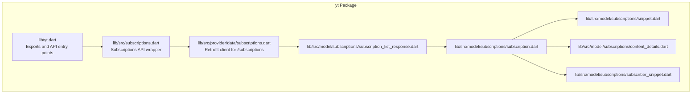
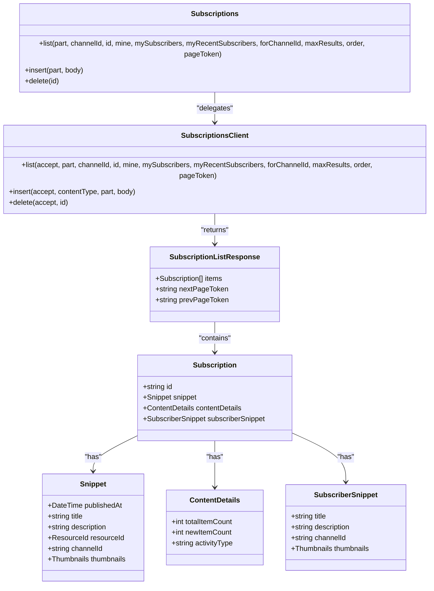
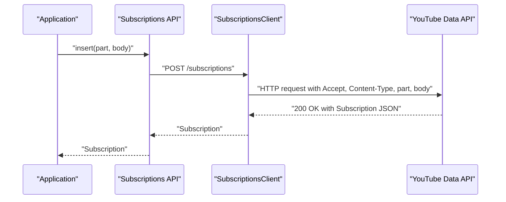
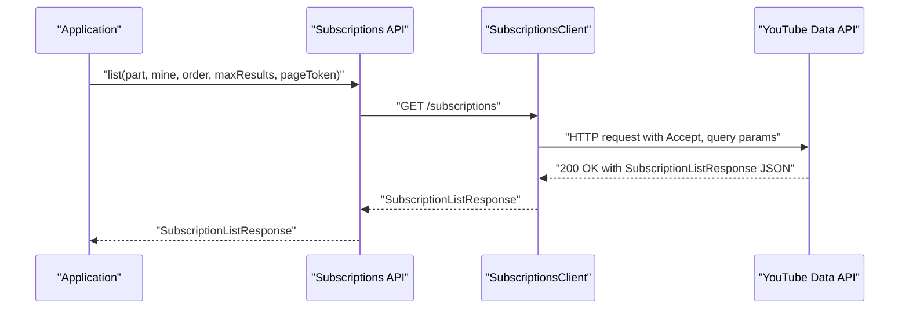
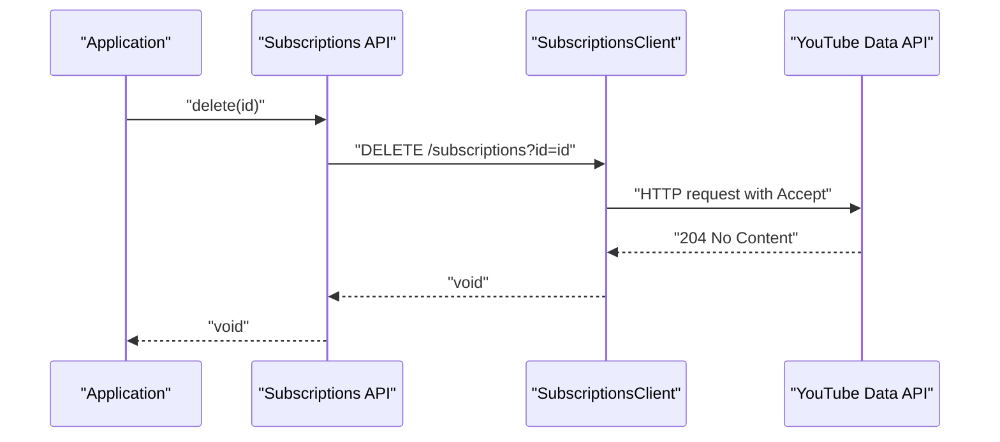
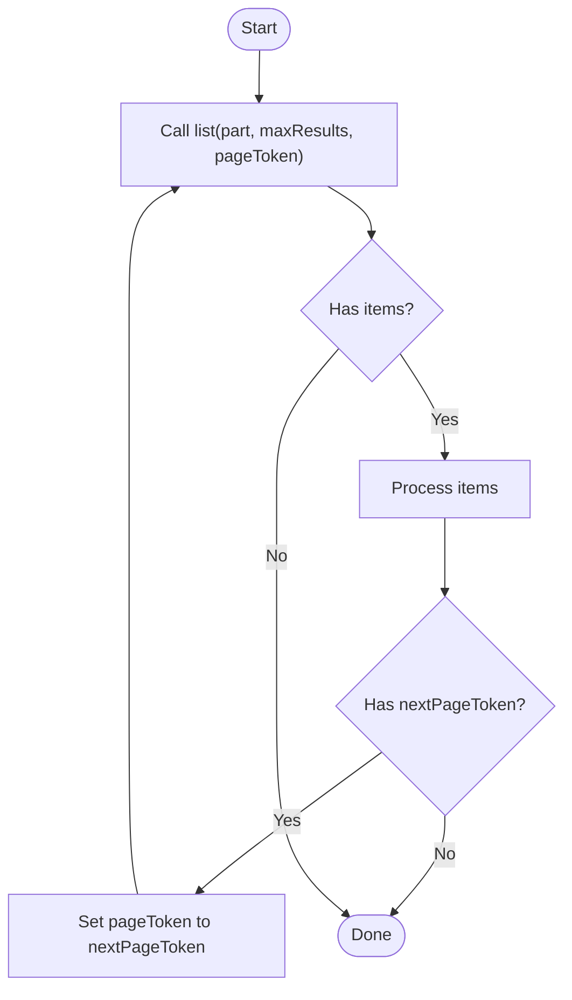
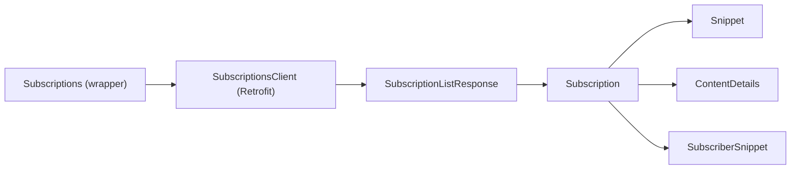

# Subscription Management

<cite>
**Referenced Files in This Document**
- [README.md](file://README.md)
- [pubspec.yaml](file://pubspec.yaml)
- [packages/yt/README.md](file://packages/yt/README.md)
- [packages/yt/lib/yt.dart](file://packages/yt/lib/yt.dart)
- [packages/yt/lib/src/subscriptions.dart](file://packages/yt/lib/src/subscriptions.dart)
- [packages/yt/lib/src/provider/data/subscriptions.dart](file://packages/yt/lib/src/provider/data/subscriptions.dart)
- [packages/yt/lib/src/model/subscriptions/subscription.dart](file://packages/yt/lib/src/model/subscriptions/subscription.dart)
- [packages/yt/lib/src/model/subscriptions/subscription_list_response.dart](file://packages/yt/lib/src/model/subscriptions/subscription_list_response.dart)
- [packages/yt/lib/src/model/subscriptions/snippet.dart](file://packages/yt/lib/src/model/subscriptions/snippet.dart)
- [packages/yt/lib/src/model/subscriptions/content_details.dart](file://packages/yt/lib/src/model/subscriptions/content_details.dart)
- [packages/yt/lib/src/model/subscriptions/subscriber_snippet.dart](file://packages/yt/lib/src/model/subscriptions/subscriber_snippet.dart)
</cite>

## Table of Contents
1. [Introduction](#introduction)
2. [Project Structure](#project-structure)
3. [Core Components](#core-components)
4. [Architecture Overview](#architecture-overview)
5. [Detailed Component Analysis](#detailed-component-analysis)
6. [Dependency Analysis](#dependency-analysis)
7. [Performance Considerations](#performance-considerations)
8. [Troubleshooting Guide](#troubleshooting-guide)
9. [Conclusion](#conclusion)
10. [Appendices](#appendices)

## Introduction
This document provides comprehensive subscription management documentation for YouTube channel subscription operations within the yt workspace. It explains how to create, list, and delete subscriptions, including authorization requirements, permission handling, and the subscription resource structure. It also covers pagination for subscription lists, filtering options, subscription state management, and integration patterns with content discovery systems. Practical examples and best practices for subscription-based content curation and automated workflows are included.

## Project Structure
The yt workspace is organized as a multi-package repository. Subscription management is implemented in the core yt package and exposed through a dedicated API surface. The relevant files include:
- Public exports and API entry points
- Subscription service implementation
- Retrofit-based provider for YouTube Data API v3 subscriptions endpoint
- Strongly typed models for subscription resources, snippet, contentDetails, and subscriberSnippet

**Diagram sources**
- [packages/yt/lib/yt.dart:41-62](file://packages/yt/lib/yt.dart#L41-L62)
- [packages/yt/lib/src/subscriptions.dart:10-75](file://packages/yt/lib/src/subscriptions.dart#L10-L75)
- [packages/yt/lib/src/provider/data/subscriptions.dart:11-53](file://packages/yt/lib/src/provider/data/subscriptions.dart#L11-L53)
- [packages/yt/lib/src/model/subscriptions/subscription.dart:16-46](file://packages/yt/lib/src/model/subscriptions/subscription.dart#L16-L46)
- [packages/yt/lib/src/model/subscriptions/subscription_list_response.dart:12-36](file://packages/yt/lib/src/model/subscriptions/subscription_list_response.dart#L12-L36)
- [packages/yt/lib/src/model/subscriptions/snippet.dart:13-58](file://packages/yt/lib/src/model/subscriptions/snippet.dart#L13-L58)
- [packages/yt/lib/src/model/subscriptions/content_details.dart:7-36](file://packages/yt/lib/src/model/subscriptions/content_details.dart#L7-L36)
- [packages/yt/lib/src/model/subscriptions/subscriber_snippet.dart:9-38](file://packages/yt/lib/src/model/subscriptions/subscriber_snippet.dart#L9-L38)

**Section sources**
- [pubspec.yaml:7-12](file://pubspec.yaml#L7-L12)
- [packages/yt/README.md:1-523](file://packages/yt/README.md#L1-L523)
- [packages/yt/lib/yt.dart:41-62](file://packages/yt/lib/yt.dart#L41-L62)

## Core Components
- Subscriptions API wrapper: Provides methods to list, insert, and delete subscriptions with configurable parts and filters.
- Retrofit client: Implements the YouTube Data API v3 /subscriptions endpoint with typed request/response handling.
- Subscription models: Strongly typed models representing the subscription resource, snippet, contentDetails, and subscriberSnippet.

Key capabilities:
- Listing subscriptions with filters such as channelId, id, mine, mySubscribers, myRecentSubscribers, forChannelId, order, and pagination via pageToken.
- Inserting a subscription by specifying the target channel via a resource ID in the request body.
- Deleting a subscription by ID.

Authorization and permissions:
- Authentication is required for subscription operations. The library supports OAuth 2.0 and API key authentication. OAuth is recommended for user-specific operations like managing subscriptions.

**Section sources**
- [packages/yt/lib/src/subscriptions.dart:10-75](file://packages/yt/lib/src/subscriptions.dart#L10-L75)
- [packages/yt/lib/src/provider/data/subscriptions.dart:11-53](file://packages/yt/lib/src/provider/data/subscriptions.dart#L11-L53)
- [packages/yt/README.md:111-150](file://packages/yt/README.md#L111-L150)

## Architecture Overview
The subscription management architecture follows a layered pattern:
- API wrapper (Subscriptions) orchestrates calls and delegates to the Retrofit client.
- Retrofit client (SubscriptionsClient) defines HTTP endpoints and serializes request/response payloads.
- Model layer (Subscription, Snippet, ContentDetails, SubscriberSnippet, SubscriptionListResponse) encapsulates resource structures and metadata.

**Diagram sources**
- [packages/yt/lib/src/subscriptions.dart:10-75](file://packages/yt/lib/src/subscriptions.dart#L10-L75)
- [packages/yt/lib/src/provider/data/subscriptions.dart:11-53](file://packages/yt/lib/src/provider/data/subscriptions.dart#L11-L53)
- [packages/yt/lib/src/model/subscriptions/subscription.dart:16-46](file://packages/yt/lib/src/model/subscriptions/subscription.dart#L16-L46)
- [packages/yt/lib/src/model/subscriptions/subscription_list_response.dart:12-36](file://packages/yt/lib/src/model/subscriptions/subscription_list_response.dart#L12-L36)
- [packages/yt/lib/src/model/subscriptions/snippet.dart:13-58](file://packages/yt/lib/src/model/subscriptions/snippet.dart#L13-L58)
- [packages/yt/lib/src/model/subscriptions/content_details.dart:7-36](file://packages/yt/lib/src/model/subscriptions/content_details.dart#L7-L36)
- [packages/yt/lib/src/model/subscriptions/subscriber_snippet.dart:9-38](file://packages/yt/lib/src/model/subscriptions/subscriber_snippet.dart#L9-L38)

## Detailed Component Analysis

### Subscriptions API Wrapper
The Subscriptions wrapper exposes three primary operations:
- list: Retrieves subscriptions with optional filters and pagination.
- insert: Creates a subscription for the authenticated user’s channel.
- delete: Removes a subscription by ID.

Authorization and headers:
- Accept and Content-Type headers are applied internally by the wrapper and Retrofit client.

Part configuration:
- The part parameter controls which fields are returned (e.g., snippet, contentDetails, subscriberSnippet, id). Defaults include all commonly used parts.

Filtering and pagination:
- Filters include channelId, id, mine, mySubscribers, myRecentSubscribers, forChannelId, order.
- Pagination uses pageToken and maxResults.

**Section sources**
- [packages/yt/lib/src/subscriptions.dart:15-75](file://packages/yt/lib/src/subscriptions.dart#L15-L75)

### Retrofit Provider for /subscriptions
The SubscriptionsClient defines the HTTP contract:
- GET /subscriptions with query parameters for filtering and pagination.
- POST /subscriptions to create a subscription using a request body containing a resource ID that identifies the target channel.
- DELETE /subscriptions to remove a subscription by ID.

Headers:
- Accept header is required for list and insert.
- Accept header is required for delete.

On-behalf parameters:
- Optional content owner parameters are supported for authorized environments.

**Section sources**
- [packages/yt/lib/src/provider/data/subscriptions.dart:11-53](file://packages/yt/lib/src/provider/data/subscriptions.dart#L11-L53)

### Subscription Resource Model
The Subscription resource aggregates:
- id: Unique identifier for the subscription.
- snippet: Basic details including publishedAt, title, description, resourceId, channelId, and thumbnails.
- contentDetails: Statistics such as totalItemCount, newItemCount, and activityType.
- subscriberSnippet: Details about the subscriber’s channel (when applicable).

These fields align with the YouTube Data API v3 subscription resource definition.

**Section sources**
- [packages/yt/lib/src/model/subscriptions/subscription.dart:16-46](file://packages/yt/lib/src/model/subscriptions/subscription.dart#L16-L46)

### Subscription List Response Model
SubscriptionListResponse extends a generic list response and includes:
- items: A list of Subscription objects matching the request criteria.
- nextPageToken and prevPageToken: Tokens for navigating paginated results.

This model enables robust pagination handling in client applications.

**Section sources**
- [packages/yt/lib/src/model/subscriptions/subscription_list_response.dart:12-36](file://packages/yt/lib/src/model/subscriptions/subscription_list_response.dart#L12-L36)

### Snippet Properties
Snippet captures:
- publishedAt: Creation timestamp.
- title and description: Human-readable identifiers.
- resourceId: Identifies the channel being subscribed to.
- channelId: The channel ID associated with the subscription.
- thumbnails: Thumbnail images for the channel.

These properties are essential for rendering subscription entries and content discovery.

**Section sources**
- [packages/yt/lib/src/model/subscriptions/snippet.dart:13-58](file://packages/yt/lib/src/model/subscriptions/snippet.dart#L13-L58)

### ContentDetails for Subscription Relationships
ContentDetails provides:
- totalItemCount: Approximate number of items the subscription points to.
- newItemCount: Number of unread/new items since last read.
- activityType: Indicates whether the subscription tracks all activity or only uploads.

These metrics support subscription state management and feed curation.

**Section sources**
- [packages/yt/lib/src/model/subscriptions/content_details.dart:7-36](file://packages/yt/lib/src/model/subscriptions/content_details.dart#L7-L36)

### SubscriberSnippet Details
SubscriberSnippet contains:
- title and description: Channel title and description of the subscriber.
- channelId: Identifier for the subscriber’s channel.
- thumbnails: Subscriber channel thumbnails.

This is useful for administrative or analytics views of who is subscribed.

**Section sources**
- [packages/yt/lib/src/model/subscriptions/subscriber_snippet.dart:9-38](file://packages/yt/lib/src/model/subscriptions/subscriber_snippet.dart#L9-L38)

### Workflow: Subscribe to a Channel
High-level steps:
- Prepare a request body with a resource ID that identifies the target channel.
- Call insert with appropriate part configuration.
- Handle the returned Subscription object to confirm creation.

**Diagram sources**
- [packages/yt/lib/src/subscriptions.dart:46-61](file://packages/yt/lib/src/subscriptions.dart#L46-L61)
- [packages/yt/lib/src/provider/data/subscriptions.dart:34-44](file://packages/yt/lib/src/provider/data/subscriptions.dart#L34-L44)

### Workflow: Retrieve Subscription Feed
High-level steps:
- Call list with desired filters (e.g., mine, order, maxResults).
- Use nextPageToken to iterate through pages until completion.
- Access items to render or process subscriptions.

**Diagram sources**
- [packages/yt/lib/src/subscriptions.dart:15-44](file://packages/yt/lib/src/subscriptions.dart#L15-L44)
- [packages/yt/lib/src/provider/data/subscriptions.dart:15-32](file://packages/yt/lib/src/provider/data/subscriptions.dart#L15-L32)

### Workflow: Unsubscribe from a Channel
High-level steps:
- Obtain the subscription ID for the target channel.
- Call delete with the ID.
- Confirm successful removal.

**Diagram sources**
- [packages/yt/lib/src/subscriptions.dart:63-74](file://packages/yt/lib/src/subscriptions.dart#L63-L74)
- [packages/yt/lib/src/provider/data/subscriptions.dart:46-52](file://packages/yt/lib/src/provider/data/subscriptions.dart#L46-L52)

### Pagination Handling for Subscription Lists
- Use maxResults to limit page size.
- Use nextPageToken to fetch subsequent pages.
- Use prevPageToken to navigate backward if needed.
- Continue until nextPageToken is absent.

**Diagram sources**
- [packages/yt/lib/src/provider/data/subscriptions.dart:15-32](file://packages/yt/lib/src/provider/data/subscriptions.dart#L15-L32)
- [packages/yt/lib/src/model/subscriptions/subscription_list_response.dart:12-36](file://packages/yt/lib/src/model/subscriptions/subscription_list_response.dart#L12-L36)

### Filtering Options
Common filters supported by the list method:
- channelId: Filter by a specific channel ID.
- id: Filter by a specific subscription ID.
- mine: Limit to the authenticated user’s subscriptions.
- mySubscribers: Retrieve subscribers of the authenticated user’s channel.
- myRecentSubscribers: Retrieve recent subscribers of the authenticated user’s channel.
- forChannelId: Retrieve subscriptions for a specific channel.
- order: Sort order (e.g., alphabetical, relevance).
- pageToken: Pagination token.

These options enable targeted retrieval for curation and analytics.

**Section sources**
- [packages/yt/lib/src/subscriptions.dart:15-44](file://packages/yt/lib/src/subscriptions.dart#L15-L44)

### Subscription State Management
State indicators derived from contentDetails:
- totalItemCount: Total items tracked by the subscription.
- newItemCount: Unread/new items since last read.
- activityType: Type of activity tracked (e.g., uploads, all).

Applications can use these to:
- Drive feed updates.
- Highlight new content.
- Manage read/unread states.

**Section sources**
- [packages/yt/lib/src/model/subscriptions/content_details.dart:7-36](file://packages/yt/lib/src/model/subscriptions/content_details.dart#L7-L36)

### Practical Examples

- Subscribing to a channel:
  - Prepare a request body with a resource ID identifying the target channel.
  - Call insert with appropriate part configuration.
  - Handle the returned Subscription object.

- Retrieving subscription feeds:
  - Call list with filters such as mine and order.
  - Iterate pages using nextPageToken.
  - Render items for content discovery.

- Managing multiple subscriptions:
  - Use filters like forChannelId and mySubscribers to manage channel-specific subscriptions.
  - Batch operations can be implemented by iterating over IDs retrieved from list.

- Handling subscription-related errors:
  - Inspect HTTP status codes and error payloads returned by the API.
  - Implement retry logic for transient failures.
  - Validate authorization tokens and scopes.

[No sources needed since this section provides general guidance]

### Best Practices for Subscription-Based Content Curation
- Use order and filters to tailor feeds for users.
- Track newItemCount to present fresh content.
- Respect rate limits and implement caching where appropriate.
- Provide unsubscribe options to maintain user trust.
- Integrate with content discovery systems by mapping resourceId to curated collections.

[No sources needed since this section provides general guidance]

### Integration Patterns with Content Discovery Systems
- Map resourceId to channel metadata for discovery.
- Use snippet and thumbnails for rich previews.
- Combine contentDetails metrics with recommendation engines.
- Support mySubscribers and myRecentSubscribers for social discovery features.

[No sources needed since this section provides general guidance]

## Dependency Analysis
The subscription module depends on:
- Retrofit for HTTP transport and serialization.
- JsonSerializable models for strong typing.
- Exported types from the yt package for unified access.

**Diagram sources**
- [packages/yt/lib/src/subscriptions.dart:10-75](file://packages/yt/lib/src/subscriptions.dart#L10-L75)
- [packages/yt/lib/src/provider/data/subscriptions.dart:11-53](file://packages/yt/lib/src/provider/data/subscriptions.dart#L11-L53)
- [packages/yt/lib/src/model/subscriptions/subscription_list_response.dart:12-36](file://packages/yt/lib/src/model/subscriptions/subscription_list_response.dart#L12-L36)
- [packages/yt/lib/src/model/subscriptions/subscription.dart:16-46](file://packages/yt/lib/src/model/subscriptions/subscription.dart#L16-L46)
- [packages/yt/lib/src/model/subscriptions/snippet.dart:13-58](file://packages/yt/lib/src/model/subscriptions/snippet.dart#L13-L58)
- [packages/yt/lib/src/model/subscriptions/content_details.dart:7-36](file://packages/yt/lib/src/model/subscriptions/content_details.dart#L7-L36)
- [packages/yt/lib/src/model/subscriptions/subscriber_snippet.dart:9-38](file://packages/yt/lib/src/model/subscriptions/subscriber_snippet.dart#L9-L38)

**Section sources**
- [packages/yt/lib/yt.dart:41-62](file://packages/yt/lib/yt.dart#L41-L62)

## Performance Considerations
- Prefer filtering (mine, forChannelId, order) to reduce payload size.
- Use maxResults judiciously to balance responsiveness and network usage.
- Cache frequently accessed subscription lists with ETags where supported.
- Minimize repeated polling by leveraging newItemCount and incremental refresh strategies.

[No sources needed since this section provides general guidance]

## Troubleshooting Guide
Common issues and resolutions:
- Authorization failures:
  - Ensure OAuth access token has required scopes.
  - Verify credentials and refresh tokens.
- Rate limiting:
  - Implement exponential backoff and retry logic.
- Invalid parameters:
  - Validate filters and IDs before calling list or delete.
- Network errors:
  - Wrap calls in try/catch and handle Dio exceptions appropriately.

[No sources needed since this section provides general guidance]

## Conclusion
The yt package provides a robust, strongly typed foundation for YouTube subscription management. With clear separation of concerns between the API wrapper, Retrofit provider, and model layer, developers can implement subscription creation, listing, and deletion workflows reliably. Proper authorization, pagination, filtering, and state management enable effective content curation and integration with discovery systems.

[No sources needed since this section summarizes without analyzing specific files]

## Appendices

### Authorization and Permissions
- Authentication is required for subscription operations.
- OAuth 2.0 is recommended for user-specific actions.
- Configure credentials per the library’s documentation.

**Section sources**
- [packages/yt/README.md:111-150](file://packages/yt/README.md#L111-L150)

### API Reference Mappings
- Subscriptions API wrapper: [packages/yt/lib/src/subscriptions.dart:10-75](file://packages/yt/lib/src/subscriptions.dart#L10-L75)
- Retrofit client: [packages/yt/lib/src/provider/data/subscriptions.dart:11-53](file://packages/yt/lib/src/provider/data/subscriptions.dart#L11-L53)
- Subscription model: [packages/yt/lib/src/model/subscriptions/subscription.dart:16-46](file://packages/yt/lib/src/model/subscriptions/subscription.dart#L16-L46)
- Subscription list response: [packages/yt/lib/src/model/subscriptions/subscription_list_response.dart:12-36](file://packages/yt/lib/src/model/subscriptions/subscription_list_response.dart#L12-L36)
- Snippet model: [packages/yt/lib/src/model/subscriptions/snippet.dart:13-58](file://packages/yt/lib/src/model/subscriptions/snippet.dart#L13-L58)
- ContentDetails model: [packages/yt/lib/src/model/subscriptions/content_details.dart:7-36](file://packages/yt/lib/src/model/subscriptions/content_details.dart#L7-L36)
- SubscriberSnippet model: [packages/yt/lib/src/model/subscriptions/subscriber_snippet.dart:9-38](file://packages/yt/lib/src/model/subscriptions/subscriber_snippet.dart#L9-L38)