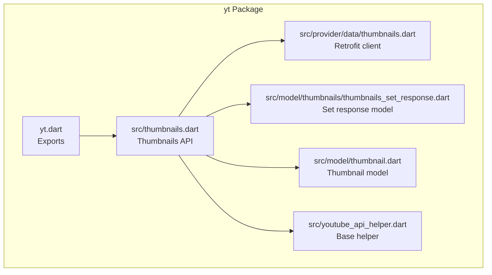
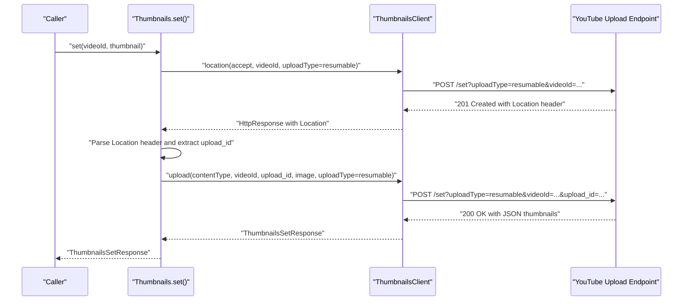
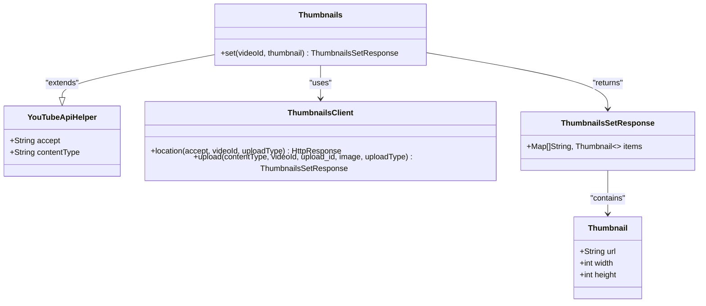

# Thumbnail Management

<cite>
**Referenced Files in This Document**
- [yt.dart](file://packages/yt/lib/yt.dart)
- [thumbnails.dart](file://packages/yt/lib/src/thumbnails.dart)
- [thumbnails.dart](file://packages/yt/lib/src/provider/data/thumbnails.dart)
- [thumbnail.dart](file://packages/yt/lib/src/model/thumbnail.dart)
- [thumbnails_set_response.dart](file://packages/yt/lib/src/model/thumbnails/thumbnails_set_response.dart)
- [youtube_api_helper.dart](file://packages/yt/lib/src/youtube_api_helper.dart)
- [README.md](file://packages/yt/README.md)
</cite>

## Table of Contents
1. [Introduction](#introduction)
2. [Project Structure](#project-structure)
3. [Core Components](#core-components)
4. [Architecture Overview](#architecture-overview)
5. [Detailed Component Analysis](#detailed-component-analysis)
6. [Dependency Analysis](#dependency-analysis)
7. [Performance Considerations](#performance-considerations)
8. [Troubleshooting Guide](#troubleshooting-guide)
9. [Conclusion](#conclusion)
10. [Appendices](#appendices)

## Introduction
This document explains thumbnail management for YouTube using the yt package. It focuses on uploading custom thumbnails to videos and live broadcasts, including resumable uploads, supported thumbnail sizes (default, medium, high, standard, maxres), and quality considerations. It also documents the set() method, upload URI generation, error handling, thumbnail URL retrieval, selection strategies, and best practices for optimization across devices.

## Project Structure
The thumbnail feature is implemented in the yt core package under the src/thumbnails.dart module and its supporting provider and model files. The public API surface is exported via yt.dart.

**Diagram sources**
- [yt.dart](file://packages/yt/lib/yt.dart)
- [thumbnails.dart](file://packages/yt/lib/src/thumbnails.dart)
- [thumbnails.dart](file://packages/yt/lib/src/provider/data/thumbnails.dart)
- [thumbnail.dart](file://packages/yt/lib/src/model/thumbnail.dart)
- [thumbnails_set_response.dart](file://packages/yt/lib/src/model/thumbnails/thumbnails_set_response.dart)
- [youtube_api_helper.dart](file://packages/yt/lib/src/youtube_api_helper.dart)

**Section sources**
- [yt.dart](file://packages/yt/lib/yt.dart)
- [thumbnails.dart](file://packages/yt/lib/src/thumbnails.dart)

## Core Components
- Thumbnails API: Provides the set() method to upload a custom thumbnail to a video or live broadcast.
- Provider client: Retrofit-based ThumbnailsClient that communicates with the YouTube upload endpoint.
- Models: Thumbnail and ThumbnailsSetResponse represent thumbnail metadata and the response after setting a thumbnail.
- Helper base: YouTubeApiHelper supplies common HTTP headers and utilities.

Key capabilities:
- Resumable uploads via the resumable upload protocol.
- Supported thumbnail sizes: default, medium, high, standard, maxres.
- Quality handling: Uploaded images are resized to fit target dimensions while preserving aspect ratio; cropping is not applied.

**Section sources**
- [thumbnails.dart](file://packages/yt/lib/src/thumbnails.dart)
- [thumbnails.dart](file://packages/yt/lib/src/provider/data/thumbnails.dart)
- [thumbnail.dart](file://packages/yt/lib/src/model/thumbnail.dart)
- [thumbnails_set_response.dart](file://packages/yt/lib/src/model/thumbnails/thumbnails_set_response.dart)
- [youtube_api_helper.dart](file://packages/yt/lib/src/youtube_api_helper.dart)

## Architecture Overview
The thumbnail upload flow uses a two-step resumable upload:
1. Request an upload location with a resumable session.
2. Upload the image payload to the returned URI with an upload_id.

**Diagram sources**
- [thumbnails.dart](file://packages/yt/lib/src/thumbnails.dart)
- [thumbnails.dart](file://packages/yt/lib/src/provider/data/thumbnails.dart)

## Detailed Component Analysis

### Thumbnails API: set()
Purpose:
- Upload a custom thumbnail image to a given video or live broadcast and set it as the current thumbnail.

Behavior:
- Uses resumable uploads with uploadType=resumable.
- Requests an upload URI via the location endpoint.
- Extracts upload_id from the Location header.
- Uploads the image payload to the returned URI.

Error handling:
- Throws if the Location header is missing.
- Throws if upload_id is not present in the Location URI query parameters.

Return type:
- ThumbnailsSetResponse containing items with thumbnail metadata across sizes.

Integration:
- Works with both videos and live broadcasts (broadcast IDs are valid videoId values for the endpoint).

**Section sources**
- [thumbnails.dart](file://packages/yt/lib/src/thumbnails.dart)

### Provider Client: ThumbnailsClient
Endpoints:
- GET location: Creates a resumable upload session and returns a Location header with upload_id.
- POST upload: Performs the actual upload using the upload_id.

Headers and parameters:
- Accept: application/json
- Content-Type: application/x-www-form-urlencoded for the upload
- Query parameters: videoId, uploadType, upload_id

Implementation notes:
- Retrofit-generated client handles request composition and response parsing.

**Section sources**
- [thumbnails.dart](file://packages/yt/lib/src/provider/data/thumbnails.dart)

### Models: Thumbnail and ThumbnailsSetResponse
Thumbnail:
- Fields: url, width, height.
- Used inside ThumbnailsSetResponse.items to represent per-size thumbnails.

ThumbnailsSetResponse:
- Extends ResponseMetadata with kind and etag.
- Contains items: a list of maps from size name to Thumbnail.

Usage:
- Returned by set() after successful upload to reflect the available thumbnail sizes.

**Section sources**
- [thumbnail.dart](file://packages/yt/lib/src/model/thumbnail.dart)
- [thumbnails_set_response.dart](file://packages/yt/lib/src/model/thumbnails/thumbnails_set_response.dart)

### Base Helper: YouTubeApiHelper
Responsibilities:
- Supplies common HTTP headers (Accept, Content-Type).
- Provides helper utilities for building parts lists in other API modules.

Relevance to thumbnails:
- Ensures consistent header usage for thumbnail requests.

**Section sources**
- [youtube_api_helper.dart](file://packages/yt/lib/src/youtube_api_helper.dart)

### Supported Thumbnail Sizes and Quality
Supported sizes:
- default, medium, high, standard, maxres.

Characteristics:
- Different resource types may support different sizes.
- Same size names may have different pixel dimensions across resource types.
- If an uploaded image does not match required dimensions, it is resized to fit while preserving aspect ratio; cropping is not applied.

Practical implications:
- Prefer source images that closely match target dimensions to minimize resizing artifacts.
- Test thumbnails across devices to confirm legibility at smaller sizes.

**Section sources**
- [thumbnails.dart](file://packages/yt/lib/src/thumbnails.dart)
- [thumbnails.dart](file://packages/yt/lib/src/provider/data/thumbnails.dart)

### Thumbnail URL Retrieval and Selection Strategies
Retrieval:
- After a successful set(), use ThumbnailsSetResponse.items to access thumbnails per size.
- Each size maps to a Thumbnail with url, width, and height.

Selection strategies:
- Choose the smallest size that maintains clarity on your target device density.
- For responsive layouts, prefer standard or high for larger previews and default for compact lists.
- Consider aspect ratio consistency; YouTube preserves aspect ratio during resize.

Best practices:
- Provide a high-resolution source to maximize quality across sizes.
- Validate that the chosen thumbnail remains recognizable at the smallest size.

**Section sources**
- [thumbnails_set_response.dart](file://packages/yt/lib/src/model/thumbnails/thumbnails_set_response.dart)
- [thumbnail.dart](file://packages/yt/lib/src/model/thumbnail.dart)

### Practical Workflows and Examples
Example: Uploading a thumbnail to a live broadcast
- Steps:
  - Create a broadcast (broadcasts API).
  - Call thumbnails.set(videoId=broadcastId, thumbnail=File(...)).
  - Inspect ThumbnailsSetResponse.items to confirm sizes and URLs.

Example: Uploading a thumbnail to a video
- Steps:
  - Upload a video (videos API) to obtain a videoId.
  - Call thumbnails.set(videoId=videoId, thumbnail=File(...)).
  - Use the returned items to select the appropriate thumbnail URL for display.

Note: The README demonstrates thumbnail upload in the context of live streaming.

**Section sources**
- [README.md](file://packages/yt/README.md)

## Dependency Analysis
Relationships:
- Thumbnails depends on ThumbnailsClient for HTTP operations.
- ThumbnailsClient is Retrofit-generated and consumes Dio for networking.
- Models (Thumbnail, ThumbnailsSetResponse) are used for serialization/deserialization.
- YouTubeApiHelper provides shared HTTP configuration.

**Diagram sources**
- [thumbnails.dart](file://packages/yt/lib/src/thumbnails.dart)
- [thumbnails.dart](file://packages/yt/lib/src/provider/data/thumbnails.dart)
- [thumbnail.dart](file://packages/yt/lib/src/model/thumbnail.dart)
- [thumbnails_set_response.dart](file://packages/yt/lib/src/model/thumbnails/thumbnails_set_response.dart)
- [youtube_api_helper.dart](file://packages/yt/lib/src/youtube_api_helper.dart)

**Section sources**
- [thumbnails.dart](file://packages/yt/lib/src/thumbnails.dart)
- [thumbnails.dart](file://packages/yt/lib/src/provider/data/thumbnails.dart)
- [thumbnail.dart](file://packages/yt/lib/src/model/thumbnail.dart)
- [thumbnails_set_response.dart](file://packages/yt/lib/src/model/thumbnails/thumbnails_set_response.dart)
- [youtube_api_helper.dart](file://packages/yt/lib/src/youtube_api_helper.dart)

## Performance Considerations
- Resumable uploads:
  - Suitable for large images and unreliable networks; the session persists until completion.
  - Use appropriate retry/backoff strategies on transient failures.
- Image sizing:
  - Provide a high-resolution source to minimize server-side scaling artifacts.
  - Avoid unnecessarily large files to reduce upload time and bandwidth.
- Device targeting:
  - Choose the smallest size that preserves clarity on your lowest-density target device.
  - Test thumbnails on mobile and desktop to ensure readability.

## Troubleshooting Guide
Common issues and resolutions:
- Missing Location header:
  - Symptom: Exception indicating the upload location could not be determined.
  - Cause: Unexpected response from the upload endpoint.
  - Action: Verify authentication, network connectivity, and that videoId is valid.

- Missing upload_id:
  - Symptom: Exception indicating the upload ID could not be determined.
  - Cause: Location URI lacks upload_id query parameter.
  - Action: Retry the location request; ensure uploadType=resumable is used.

- Invalid videoId:
  - Symptom: Upload failure due to invalid resource identifier.
  - Action: Confirm the videoId corresponds to an existing video or live broadcast.

- Authentication errors:
  - Symptom: 401/403 responses.
  - Action: Reauthorize and ensure the access token has required scopes.

- Network interruptions:
  - Symptom: Partial upload failures.
  - Action: Retry using the same upload_id; resumable sessions can resume.

**Section sources**
- [thumbnails.dart](file://packages/yt/lib/src/thumbnails.dart)

## Conclusion
The yt package provides a robust, resumable thumbnail upload mechanism via the set() method. It supports multiple thumbnail sizes and preserves aspect ratio during resizing. By following the recommended workflows, selecting appropriate thumbnails for each device class, and handling errors gracefully, developers can optimize thumbnail presentation across YouTube and integrated applications.

## Appendices

### Thumbnail Dimensions and Aspect Ratios
- Supported sizes: default, medium, high, standard, maxres.
- Behavior: Images are scaled to fit target dimensions without cropping; aspect ratio is preserved.
- Recommendation: Supply a high-resolution source to maintain quality across sizes.

**Section sources**
- [thumbnails.dart](file://packages/yt/lib/src/thumbnails.dart)
- [thumbnails.dart](file://packages/yt/lib/src/provider/data/thumbnails.dart)