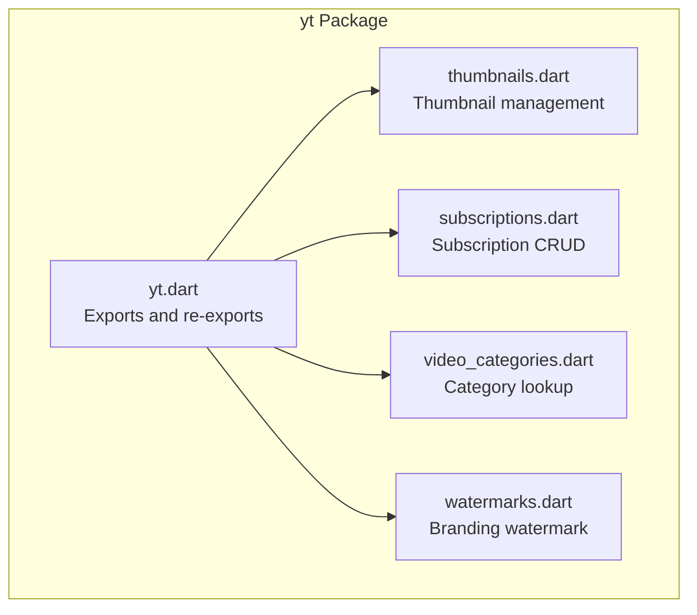
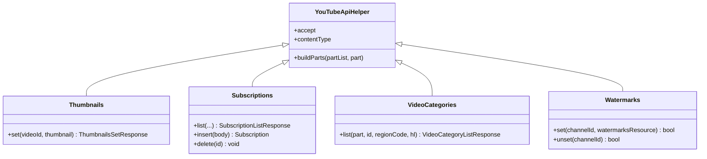
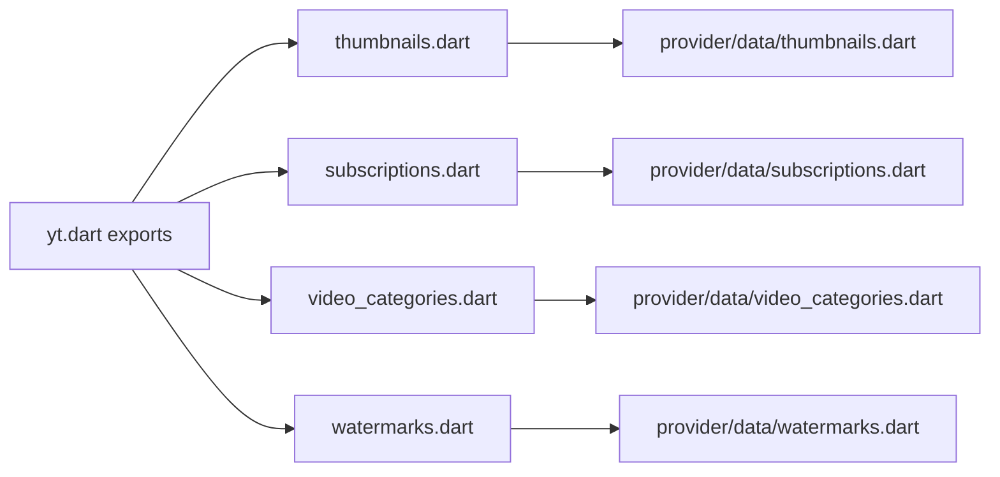

# Utility Modules

<cite>
**Referenced Files in This Document**
- [yt.dart](file://packages/yt/lib/yt.dart)
- [thumbnails.dart](file://packages/yt/lib/src/thumbnails.dart)
- [subscriptions.dart](file://packages/yt/lib/src/subscriptions.dart)
- [video_categories.dart](file://packages/yt/lib/src/video_categories.dart)
- [watermarks.dart](file://packages/yt/lib/src/watermarks.dart)
- [README.md](file://packages/yt/README.md)
</cite>

## Table of Contents
1. [Introduction](#introduction)
2. [Project Structure](#project-structure)
3. [Core Components](#core-components)
4. [Architecture Overview](#architecture-overview)
5. [Detailed Component Analysis](#detailed-component-analysis)
6. [Dependency Analysis](#dependency-analysis)
7. [Performance Considerations](#performance-considerations)
8. [Troubleshooting Guide](#troubleshooting-guide)
9. [Conclusion](#conclusion)

## Introduction
This document describes the supplementary utility modules that extend the core YouTube Data and Live Streaming APIs with specialized capabilities for:
- Thumbnail management: selecting and uploading thumbnails for videos and live broadcasts
- Subscription management: listing, adding, and removing channel subscriptions
- Video category lookup and filtering: retrieving and filtering categories by region and language
- Watermark configuration: setting and removing branded watermarks for content protection

Each module’s purpose, configuration options, integration patterns, and recommended usage are documented with practical examples and best practices.

## Project Structure
The yt package exposes a cohesive API surface through a central export and per-feature modules. The utility modules are implemented as thin wrappers around generated clients and share a common base for HTTP interactions and response handling.

**Diagram sources**
- [yt.dart:1-75](file://packages/yt/lib/yt.dart#L1-L75)
- [thumbnails.dart:1-53](file://packages/yt/lib/src/thumbnails.dart#L1-L53)
- [subscriptions.dart:1-76](file://packages/yt/lib/src/subscriptions.dart#L1-L76)
- [video_categories.dart:1-31](file://packages/yt/lib/src/video_categories.dart#L1-L31)
- [watermarks.dart:1-50](file://packages/yt/lib/src/watermarks.dart#L1-L50)

**Section sources**
- [yt.dart:1-75](file://packages/yt/lib/yt.dart#L1-L75)

## Core Components
This section summarizes each utility module’s responsibilities and primary operations.

- Thumbnails
  - Purpose: Upload and set thumbnails for videos or live broadcasts using resumable uploads.
  - Key operation: set(videoId, thumbnailFile)
  - Notes: Uses resumable upload protocol and requires a valid videoId.

- Subscriptions
  - Purpose: Manage user subscriptions to channels.
  - Key operations: list(), insert(), delete()
  - Notes: Supports filtering by channelId, id, mine, mySubscribers, and other parameters.

- Video Categories
  - Purpose: Retrieve available video categories for a given region and language.
  - Key operation: list(id?, regionCode?, hl?)
  - Notes: Useful for populating category selection UIs.

- Watermarks
  - Purpose: Configure branded watermarks for a channel.
  - Key operations: set(channelId, watermarksResource), unset(channelId)
  - Notes: Enforces file size and MIME constraints.

**Section sources**
- [thumbnails.dart:16-52](file://packages/yt/lib/src/thumbnails.dart#L16-L52)
- [subscriptions.dart:10-75](file://packages/yt/lib/src/subscriptions.dart#L10-L75)
- [video_categories.dart:7-30](file://packages/yt/lib/src/video_categories.dart#L7-L30)
- [watermarks.dart:11-49](file://packages/yt/lib/src/watermarks.dart#L11-L49)

## Architecture Overview
The utility modules follow a consistent pattern:
- Extend a shared base class for HTTP interactions
- Delegate to generated provider clients for API calls
- Return strongly typed response models

**Diagram sources**
- [yt.dart:1-75](file://packages/yt/lib/yt.dart#L1-L75)
- [thumbnails.dart:16-52](file://packages/yt/lib/src/thumbnails.dart#L16-L52)
- [subscriptions.dart:10-75](file://packages/yt/lib/src/subscriptions.dart#L10-L75)
- [video_categories.dart:7-30](file://packages/yt/lib/src/video_categories.dart#L7-L30)
- [watermarks.dart:11-49](file://packages/yt/lib/src/watermarks.dart#L11-L49)

## Detailed Component Analysis

### Thumbnail Management
Purpose
- Set thumbnails for videos or live broadcasts using resumable uploads.

Key Operation
- set(videoId, thumbnailFile): Initiates resumable upload and returns a structured response indicating success.

Behavior
- Requests an upload location header and parses the upload_id from the response.
- Validates presence of required headers and parameters before proceeding.
- Uploads the thumbnail file to the resolved URI.

Integration Pattern
- After obtaining a videoId (e.g., from creating a live broadcast), call set() with the File handle of the desired thumbnail image.

Practical Example Paths
- Resumable upload flow for thumbnails: [thumbnails.set(...):22-51](file://packages/yt/lib/src/thumbnails.dart#L22-L51)
- Example usage in README for live broadcast thumbnail upload: [README example:245-249](file://packages/yt/README.md#L245-L249)

Best Practices
- Ensure the thumbnail meets YouTube’s aspect ratio and dimension expectations; the platform scales without cropping.
- Use appropriate image formats and sizes to minimize upload time.
- Handle missing location headers and invalid upload_id gracefully.

Common Use Cases
- Uploading a custom thumbnail for a scheduled live broadcast.
- Updating a video’s thumbnail after editing.

**Section sources**
- [thumbnails.dart:16-52](file://packages/yt/lib/src/thumbnails.dart#L16-L52)
- [README.md:245-249](file://packages/yt/README.md#L245-L249)

### Subscription Management
Purpose
- Manage a user’s channel subscriptions: list, add, and remove.

Key Operations
- list(): Retrieve subscriptions with optional filters (channelId, mine, mySubscribers, etc.).
- insert(): Add a subscription for the authenticated user’s channel.
- delete(): Remove a subscription by id.

Behavior
- Accepts a flexible part parameter and supports additional query parameters for filtering and pagination.

Integration Pattern
- Use list() to populate a UI with current subscriptions.
- Use insert() to subscribe to a channel by providing the appropriate request body.
- Use delete() to unsubscribe.

Practical Example Paths
- Subscription list operation: [subscriptions.list(...):16-44](file://packages/yt/lib/src/subscriptions.dart#L16-L44)
- Subscription insert operation: [subscriptions.insert(...):47-61](file://packages/yt/lib/src/subscriptions.dart#L47-L61)
- Subscription delete operation: [subscriptions.delete(...):64-74](file://packages/yt/lib/src/subscriptions.dart#L64-L74)

Best Practices
- Always validate the id parameter for delete() to avoid unintended removals.
- Use paging with pageToken for large subscription lists.
- Respect order parameter if ordering matters for display.

Common Use Cases
- Building a “Subscriptions” screen in a content management dashboard.
- Auto-subscribing users to official channels upon onboarding.

**Section sources**
- [subscriptions.dart:10-75](file://packages/yt/lib/src/subscriptions.dart#L10-L75)

### Video Category Lookup and Filtering
Purpose
- Retrieve and filter video categories for a given region and language.

Key Operation
- list(part, id?, regionCode?, hl?): Returns a list of categories suitable for UI selection.

Behavior
- Supports filtering by id to fetch a specific category.
- regionCode determines the country-specific category set.
- hl controls localization of category names.

Integration Pattern
- Call list() early in your app initialization to populate category dropdowns.
- Optionally filter by id for pre-selection.

Practical Example Paths
- Category list operation: [video_categories.list(...):17-29](file://packages/yt/lib/src/video_categories.dart#L17-L29)

Best Practices
- Cache category lists locally to reduce repeated network calls.
- Combine regionCode and hl with user locale for optimal UX.

Common Use Cases
- Pre-populating category selection in a video upload form.
- Providing localized category names for international audiences.

**Section sources**
- [video_categories.dart:7-30](file://packages/yt/lib/src/video_categories.dart#L7-L30)

### Watermark Configuration
Purpose
- Configure branded watermarks for a channel to protect content and reinforce branding.

Key Operations
- set(channelId, watermarksResource): Uploads and applies a watermark image.
- unset(channelId): Removes the watermark.

Behavior
- set() enforces file size limits and accepted MIME types.
- Both methods return a boolean indicating whether the HTTP response status is successful.

Integration Pattern
- Prepare a WatermarksResource with positioning and timing preferences.
- Call set() to apply; call unset() to remove.

Practical Example Paths
- Watermark set operation: [watermarks.set(...):23-38](file://packages/yt/lib/src/watermarks.dart#L23-L38)
- Watermark unset operation: [watermarks.unset(...):40-48](file://packages/yt/lib/src/watermarks.dart#L40-L48)

Best Practices
- Use PNG or JPEG images optimized for transparency and size under the 10MB limit.
- Position watermarks to minimize visual impact while ensuring visibility.
- Test watermark visibility across devices and screen sizes.

Common Use Cases
- Branding overlays for live streams and VOD content.
- Legal notices or copyright markings.

**Section sources**
- [watermarks.dart:11-49](file://packages/yt/lib/src/watermarks.dart#L11-L49)

## Dependency Analysis
The utility modules depend on:
- Shared base class for HTTP helpers and response building
- Generated provider clients for API endpoints
- Strongly typed response models

**Diagram sources**
- [yt.dart:1-75](file://packages/yt/lib/yt.dart#L1-L75)
- [thumbnails.dart:1-6](file://packages/yt/lib/src/thumbnails.dart#L1-L6)
- [subscriptions.dart:1-5](file://packages/yt/lib/src/subscriptions.dart#L1-L5)
- [video_categories.dart:1-5](file://packages/yt/lib/src/video_categories.dart#L1-L5)
- [watermarks.dart:1-5](file://packages/yt/lib/src/watermarks.dart#L1-L5)

**Section sources**
- [yt.dart:1-75](file://packages/yt/lib/yt.dart#L1-L75)

## Performance Considerations
- Thumbnails
  - Prefer smaller, appropriately sized images to reduce upload time.
  - Reuse upload sessions when retrying failed uploads.
- Subscriptions
  - Paginate results using pageToken for large lists.
  - Cache frequently accessed subscription metadata.
- Video Categories
  - Cache category lists locally; invalidate on region or language changes.
- Watermarks
  - Optimize image assets for fast delivery and minimal bandwidth.
  - Avoid frequent toggling of watermark state; batch updates when possible.

## Troubleshooting Guide
- Thumbnail upload failures
  - Verify the videoId exists and is accessible.
  - Confirm the upload location header and upload_id are present.
  - Ensure the thumbnail meets aspect ratio and dimension guidelines.

- Subscription errors
  - Validate the id passed to delete() matches an existing subscription.
  - Check permissions and ensure the authenticated account can manage subscriptions.

- Video categories not loading
  - Confirm regionCode and hl values are valid ISO codes.
  - Retry network requests with exponential backoff.

- Watermarks not applying
  - Check file size (< 10MB) and MIME type.
  - Ensure channelId is correct and the authenticated account has permission to modify watermark settings.

**Section sources**
- [thumbnails.dart:22-51](file://packages/yt/lib/src/thumbnails.dart#L22-L51)
- [subscriptions.dart:64-74](file://packages/yt/lib/src/subscriptions.dart#L64-L74)
- [watermarks.dart:23-48](file://packages/yt/lib/src/watermarks.dart#L23-L48)

## Conclusion
These utility modules streamline common content management tasks on YouTube:
- Thumbnails: robust resumable uploads for video and live broadcast imagery
- Subscriptions: full CRUD lifecycle for managing channel subscriptions
- Video Categories: localized, region-aware category retrieval
- Watermarks: configurable branding overlays for content protection

Adopt the integration patterns and best practices outlined here to build reliable, efficient workflows for content creators and platform integrators.