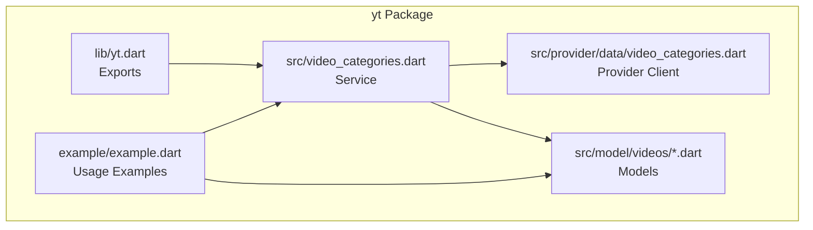
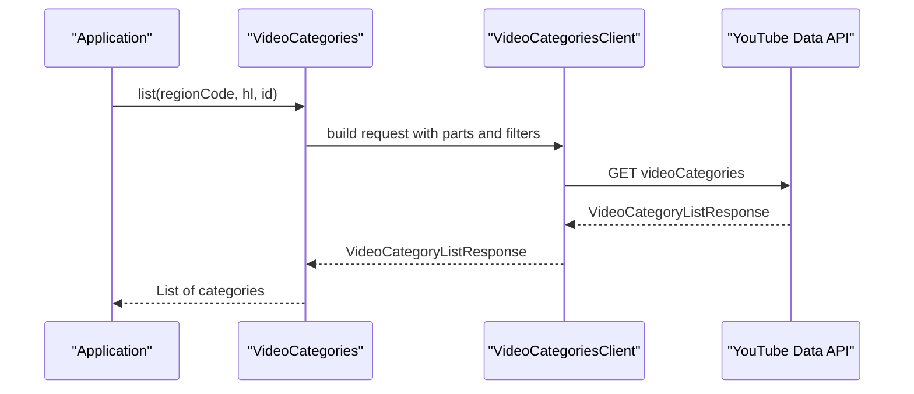
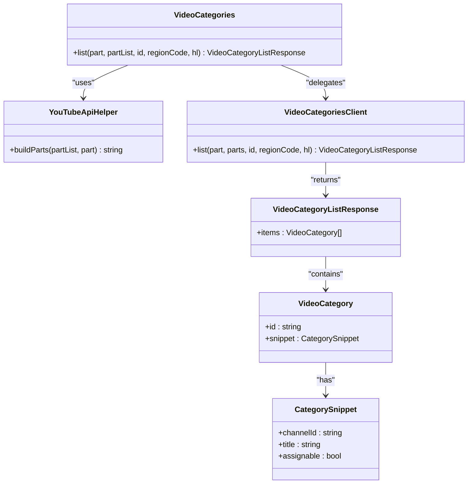
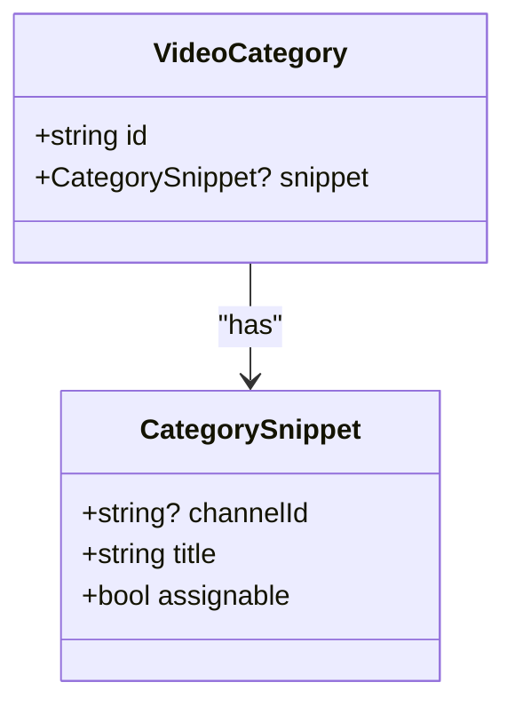
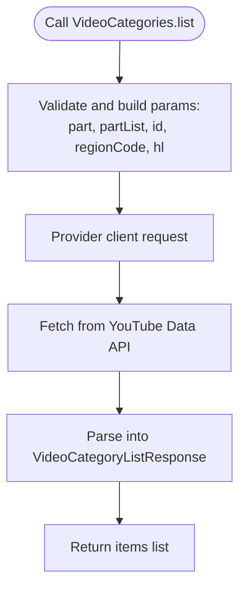
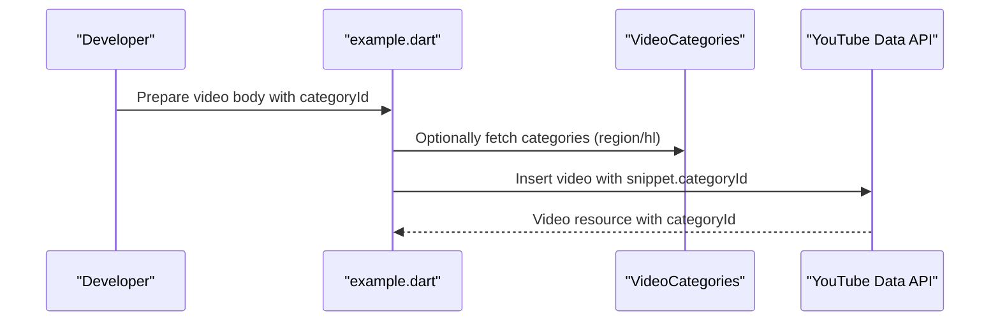
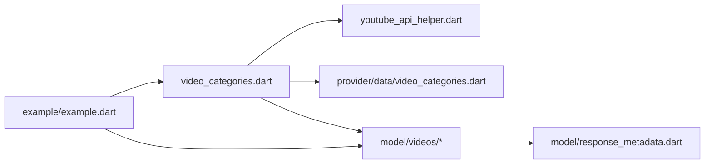

# Video Categories

<cite>
**Referenced Files in This Document**
- [README.md](file://README.md)
- [packages/yt/README.md](file://packages/yt/README.md)
- [packages/yt/lib/yt.dart](file://packages/yt/lib/yt.dart)
- [packages/yt/lib/src/video_categories.dart](file://packages/yt/lib/src/video_categories.dart)
- [packages/yt/lib/src/provider/data/video_categories.dart](file://packages/yt/lib/src/provider/data/video_categories.dart)
- [packages/yt/lib/src/model/videos/video_category.dart](file://packages/yt/lib/src/model/videos/video_category.dart)
- [packages/yt/lib/src/model/videos/category_snippet.dart](file://packages/yt/lib/src/model/videos/category_snippet.dart)
- [packages/yt/lib/src/model/videos/video_category_list_response.dart](file://packages/yt/lib/src/model/videos/video_category_list_response.dart)
- [packages/yt/lib/src/youtube_api_helper.dart](file://packages/yt/lib/src/youtube_api_helper.dart)
- [packages/yt/lib/src/model/response_metadata.dart](file://packages/yt/lib/src/model/response_metadata.dart)
- [packages/yt/example/example.dart](file://packages/yt/example/example.dart)
</cite>

## Table of Contents
1. [Introduction](#introduction)
2. [Project Structure](#project-structure)
3. [Core Components](#core-components)
4. [Architecture Overview](#architecture-overview)
5. [Detailed Component Analysis](#detailed-component-analysis)
6. [Dependency Analysis](#dependency-analysis)
7. [Performance Considerations](#performance-considerations)
8. [Troubleshooting Guide](#troubleshooting-guide)
9. [Conclusion](#conclusion)
10. [Appendices](#appendices)

## Introduction
This document explains how to discover, manage, and integrate YouTube video categories using the yt package. It focuses on:
- Category lookup across regions
- Category ID mapping and hierarchy
- Filtering and organizing content by category
- Category metadata (names, descriptions, and localization)
- Practical workflows for category assignment and automated classification
- Localization considerations and persistence of category IDs across regions
- Integration patterns with content categorization systems

The documentation is grounded in the repository’s implementation and examples, ensuring accuracy and actionable guidance for developers integrating YouTube video categories into applications.

## Project Structure
The yt package exposes a cohesive API surface for YouTube Data and Live Streaming. For video categories, the relevant components are:
- Public exports in the main library
- The VideoCategories service class
- Provider-level client for the Data API
- Strongly typed models for category resources and responses
- Example usage demonstrating category assignment during video uploads

**Diagram sources**
- [packages/yt/lib/yt.dart:1-75](file://packages/yt/lib/yt.dart#L1-L75)
- [packages/yt/lib/src/video_categories.dart:1-31](file://packages/yt/lib/src/video_categories.dart#L1-L31)
- [packages/yt/lib/src/provider/data/video_categories.dart](file://packages/yt/lib/src/provider/data/video_categories.dart)
- [packages/yt/lib/src/model/videos/video_category.dart:1-34](file://packages/yt/lib/src/model/videos/video_category.dart#L1-L34)
- [packages/yt/lib/src/model/videos/category_snippet.dart:1-33](file://packages/yt/lib/src/model/videos/category_snippet.dart#L1-L33)
- [packages/yt/lib/src/model/videos/video_category_list_response.dart:1-32](file://packages/yt/lib/src/model/videos/video_category_list_response.dart#L1-L32)
- [packages/yt/example/example.dart](file://packages/yt/example/example.dart)

**Section sources**
- [packages/yt/lib/yt.dart:1-75](file://packages/yt/lib/yt.dart#L1-L75)
- [packages/yt/README.md:428-429](file://packages/yt/README.md#L428-L429)

## Core Components
- VideoCategories service: Provides category listing with optional filters (region, language, and category ID).
- VideoCategory model: Represents a single category resource with identifier and snippet metadata.
- CategorySnippet: Contains human-readable details such as title and assignability flag.
- VideoCategoryListResponse: Wraps a list of category resources returned by the API.
- YouTubeApiHelper base: Supplies common request building and part handling logic used by providers.

Key capabilities:
- Regional category retrieval via regionCode
- Localization via hl (language and region)
- Optional filtering by category ID
- Access to category metadata (title, assignable flag)

Practical usage is demonstrated in the example, including assigning a categoryId during video insertions.

**Section sources**
- [packages/yt/lib/src/video_categories.dart:14-30](file://packages/yt/lib/src/video_categories.dart#L14-L30)
- [packages/yt/lib/src/model/videos/video_category.dart:10-34](file://packages/yt/lib/src/model/videos/video_category.dart#L10-L34)
- [packages/yt/lib/src/model/videos/category_snippet.dart:7-33](file://packages/yt/lib/src/model/videos/category_snippet.dart#L7-L33)
- [packages/yt/lib/src/model/videos/video_category_list_response.dart:10-32](file://packages/yt/lib/src/model/videos/video_category_list_response.dart#L10-L32)
- [packages/yt/lib/src/youtube_api_helper.dart](file://packages/yt/lib/src/youtube_api_helper.dart)
- [packages/yt/example/example.dart](file://packages/yt/example/example.dart)

## Architecture Overview
The category feature follows a layered architecture:
- Service layer: VideoCategories orchestrates requests and delegates to the provider client.
- Provider layer: Encapsulates HTTP calls to the YouTube Data API for video categories.
- Model layer: Strongly typed models represent category resources and responses.
- Integration: The example demonstrates category assignment during video uploads.

**Diagram sources**
- [packages/yt/lib/src/video_categories.dart:17-29](file://packages/yt/lib/src/video_categories.dart#L17-L29)
- [packages/yt/lib/src/provider/data/video_categories.dart](file://packages/yt/lib/src/provider/data/video_categories.dart)
- [packages/yt/lib/src/model/videos/video_category_list_response.dart:10-32](file://packages/yt/lib/src/model/videos/video_category_list_response.dart#L10-L32)

## Detailed Component Analysis

### VideoCategories Service
Responsibilities:
- Accepts parameters for listing categories: part, id, regionCode, hl.
- Delegates to the provider client to fetch category data.
- Returns a strongly typed VideoCategoryListResponse.

Behavior highlights:
- Defaults to returning snippet metadata.
- Supports filtering by category ID and region.
- Uses the helper to assemble part lists.

**Diagram sources**
- [packages/yt/lib/src/video_categories.dart:7-30](file://packages/yt/lib/src/video_categories.dart#L7-L30)
- [packages/yt/lib/src/youtube_api_helper.dart](file://packages/yt/lib/src/youtube_api_helper.dart)
- [packages/yt/lib/src/provider/data/video_categories.dart](file://packages/yt/lib/src/provider/data/video_categories.dart)
- [packages/yt/lib/src/model/videos/video_category_list_response.dart:10-32](file://packages/yt/lib/src/model/videos/video_category_list_response.dart#L10-L32)
- [packages/yt/lib/src/model/videos/video_category.dart:10-34](file://packages/yt/lib/src/model/videos/video_category.dart#L10-L34)
- [packages/yt/lib/src/model/videos/category_snippet.dart:7-33](file://packages/yt/lib/src/model/videos/category_snippet.dart#L7-L33)

**Section sources**
- [packages/yt/lib/src/video_categories.dart:6-30](file://packages/yt/lib/src/video_categories.dart#L6-L30)

### Category Metadata and Localized Descriptions
CategorySnippet encapsulates:
- Channel identifier (optional)
- Title (localized)
- Assignable flag indicating whether videos can be associated with the category

VideoCategory ties the identifier and snippet together, enabling:
- Stable category ID persistence across regions
- Localized presentation via hl
- Deterministic filtering by ID

**Diagram sources**
- [packages/yt/lib/src/model/videos/category_snippet.dart:9-33](file://packages/yt/lib/src/model/videos/category_snippet.dart#L9-L33)
- [packages/yt/lib/src/model/videos/video_category.dart:12-34](file://packages/yt/lib/src/model/videos/video_category.dart#L12-L34)

**Section sources**
- [packages/yt/lib/src/model/videos/category_snippet.dart:7-33](file://packages/yt/lib/src/model/videos/category_snippet.dart#L7-L33)
- [packages/yt/lib/src/model/videos/video_category.dart:10-34](file://packages/yt/lib/src/model/videos/video_category.dart#L10-L34)

### Category Listing Workflow
The service method list accepts:
- part: response parts (defaults to snippet)
- partList: additional parts
- id: filter by specific category ID
- regionCode: restrict categories to a country
- hl: language and region for localization

**Diagram sources**
- [packages/yt/lib/src/video_categories.dart:17-29](file://packages/yt/lib/src/video_categories.dart#L17-L29)
- [packages/yt/lib/src/provider/data/video_categories.dart](file://packages/yt/lib/src/provider/data/video_categories.dart)
- [packages/yt/lib/src/model/videos/video_category_list_response.dart:10-32](file://packages/yt/lib/src/model/videos/video_category_list_response.dart#L10-L32)

**Section sources**
- [packages/yt/lib/src/video_categories.dart:14-30](file://packages/yt/lib/src/video_categories.dart#L14-L30)

### Category Assignment During Uploads
The example demonstrates assigning a categoryId during video insertions, enabling automatic categorization of newly uploaded content.

**Diagram sources**
- [packages/yt/example/example.dart](file://packages/yt/example/example.dart)
- [packages/yt/lib/src/video_categories.dart:14-30](file://packages/yt/lib/src/video_categories.dart#L14-L30)

**Section sources**
- [packages/yt/example/example.dart](file://packages/yt/example/example.dart)

## Dependency Analysis
The category feature depends on:
- YouTubeApiHelper for part construction
- Provider client for HTTP interactions
- Strongly typed models for serialization/deserialization
- Exported entry points for consumers

**Diagram sources**
- [packages/yt/lib/src/video_categories.dart:1-31](file://packages/yt/lib/src/video_categories.dart#L1-L31)
- [packages/yt/lib/src/youtube_api_helper.dart](file://packages/yt/lib/src/youtube_api_helper.dart)
- [packages/yt/lib/src/provider/data/video_categories.dart](file://packages/yt/lib/src/provider/data/video_categories.dart)
- [packages/yt/lib/src/model/response_metadata.dart](file://packages/yt/lib/src/model/response_metadata.dart)
- [packages/yt/example/example.dart](file://packages/yt/example/example.dart)

**Section sources**
- [packages/yt/lib/src/video_categories.dart:1-31](file://packages/yt/lib/src/video_categories.dart#L1-L31)
- [packages/yt/lib/yt.dart:50-66](file://packages/yt/lib/yt.dart#L50-L66)

## Performance Considerations
- Prefer filtering by regionCode and hl to reduce payload size and improve relevance.
- Use the id parameter to fetch a single category when validating assignments.
- Limit parts to only what is needed (e.g., snippet) to minimize bandwidth.
- Cache category lists per region/hl combination to avoid repeated network calls.

## Troubleshooting Guide
Common issues and resolutions:
- Authentication failures: Ensure credentials are configured and accessible. The package supports OAuth and API keys for Data API operations.
- Missing categories for a region: Verify regionCode correctness and availability; categories vary by region.
- Localization mismatch: Confirm hl parameter aligns with the intended locale; titles are localized.
- Invalid category ID: Validate against the latest category list; IDs can change over time.

Operational references:
- Authentication and credential setup are documented in the package README.
- The CLI tool can assist with authorization and testing.

**Section sources**
- [packages/yt/README.md:111-151](file://packages/yt/README.md#L111-L151)
- [packages/yt/README.md:406-430](file://packages/yt/README.md#L406-L430)

## Conclusion
The yt package provides a robust, typed foundation for discovering and managing YouTube video categories. By leveraging regionCode and hl, you can tailor category listings to your audience while maintaining stable category IDs for consistent categorization. The example demonstrates practical category assignment during uploads, and the strongly typed models ensure reliable parsing and integration into broader content management systems.

## Appendices

### Best Practices for Category Selection and Classification
- Choose categories aligned with your content and audience region.
- Use category IDs for deterministic assignment; titles may change or localize.
- Maintain a local mapping of category IDs to internal taxonomy for automation.
- Periodically refresh category lists to account for platform updates.

### Integration Patterns with Content Categorization Systems
- Preload category lists per region/hl and cache locally.
- Use category IDs as the canonical identifier for downstream systems.
- Implement fallbacks when a category is unavailable in a region.
- Automate assignment by mapping content metadata to the most relevant category ID.

### Practical Examples Index
- Category listing with region and language: [packages/yt/lib/src/video_categories.dart:17-29](file://packages/yt/lib/src/video_categories.dart#L17-L29)
- Category assignment during upload: [packages/yt/example/example.dart](file://packages/yt/example/example.dart)
- Category metadata access: [packages/yt/lib/src/model/videos/video_category.dart:12-34](file://packages/yt/lib/src/model/videos/video_category.dart#L12-L34), [packages/yt/lib/src/model/videos/category_snippet.dart:9-33](file://packages/yt/lib/src/model/videos/category_snippet.dart#L9-L33)