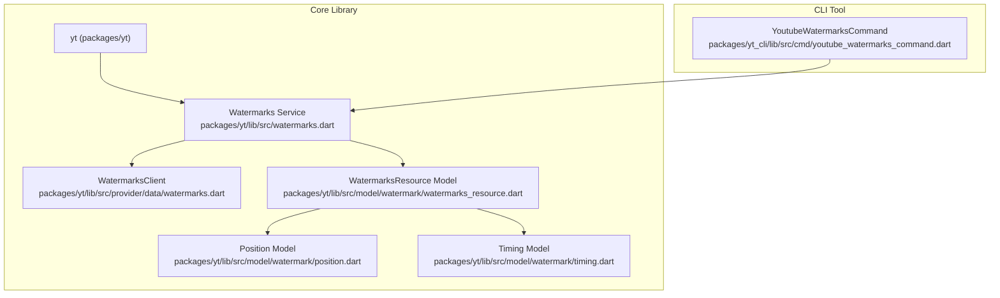
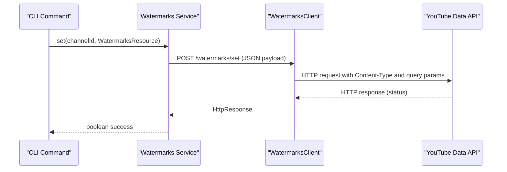
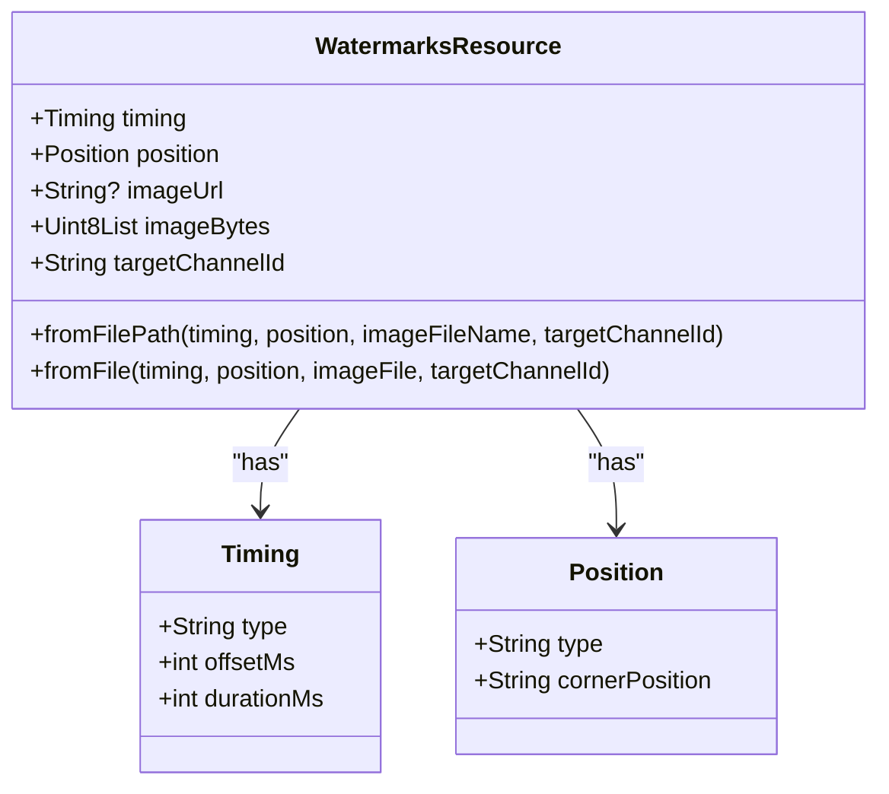
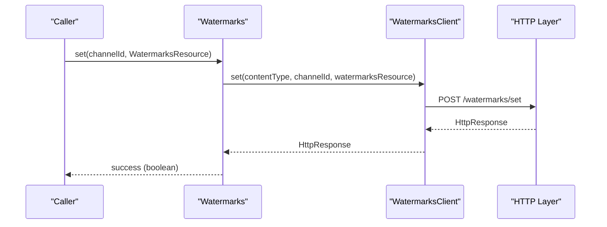
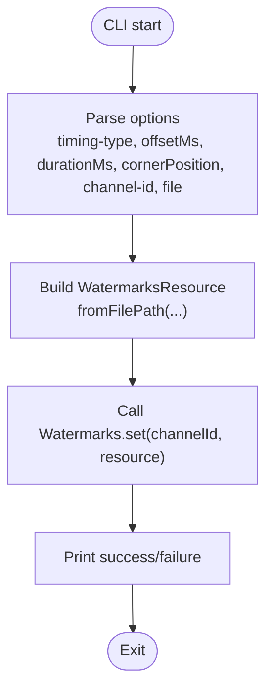
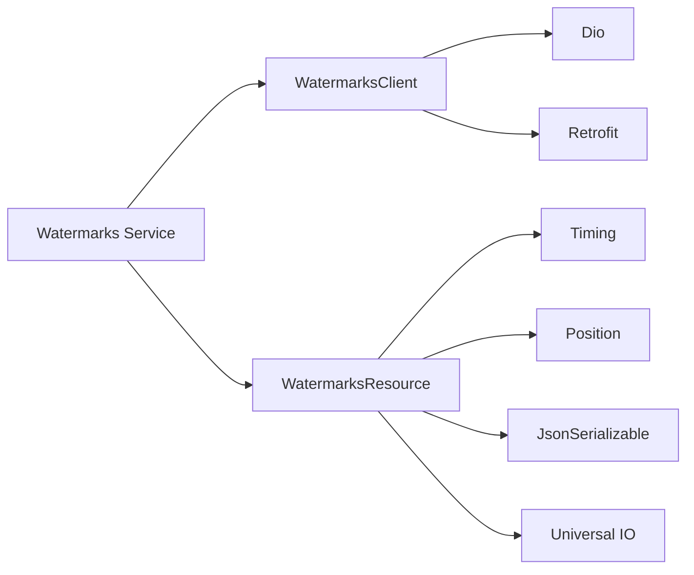

# Watermark Management

<cite>
**Referenced Files in This Document**
- [README.md](file://README.md)
- [pubspec.yaml](file://pubspec.yaml)
- [watermarks.dart](file://packages/yt/lib/src/watermarks.dart)
- [watermarks.dart](file://packages/yt/lib/src/provider/data/watermarks.dart)
- [watermarks.g.dart](file://packages/yt/lib/src/provider/data/watermarks.g.dart)
- [watermarks_resource.dart](file://packages/yt/lib/src/model/watermark/watermarks_resource.dart)
- [watermarks_resource.g.dart](file://packages/yt/lib/src/model/watermark/watermarks_resource.g.dart)
- [position.dart](file://packages/yt/lib/src/model/watermark/position.dart)
- [timing.dart](file://packages/yt/lib/src/model/watermark/timing.dart)
- [youtube_watermarks_command.dart](file://packages/yt_cli/lib/src/cmd/youtube_watermarks_command.dart)
- [example.dart](file://packages/yt/example/example.dart)
- [youtube_api_helper.dart](file://packages/yt/lib/src/youtube_api_helper.dart)
</cite>

## Table of Contents
1. [Introduction](#introduction)
2. [Project Structure](#project-structure)
3. [Core Components](#core-components)
4. [Architecture Overview](#architecture-overview)
5. [Detailed Component Analysis](#detailed-component-analysis)
6. [Dependency Analysis](#dependency-analysis)
7. [Performance Considerations](#performance-considerations)
8. [Troubleshooting Guide](#troubleshooting-guide)
9. [Conclusion](#conclusion)
10. [Appendices](#appendices)

## Introduction
This document explains the YouTube watermark management capabilities exposed by the repository. It covers how to create, upload, and manage branded watermarks for YouTube channels, including configuration of positioning, timing, and resource structure. It also documents the CLI commands for setting and removing watermarks, and outlines best practices for watermark branding, optimization across resolutions and aspect ratios, and integration with content protection workflows.

## Project Structure
The watermark feature spans the core library and the CLI tool:
- Core library: model definitions, API client, and service wrapper for watermark operations
- CLI tool: commands to set and unset watermarks with positional and timing options

**Diagram sources**
- [watermarks.dart:11-49](file://packages/yt/lib/src/watermarks.dart#L11-L49)
- [watermarks.dart:12-51](file://packages/yt/lib/src/provider/data/watermarks.dart#L12-L51)
- [watermarks_resource.dart:17-44](file://packages/yt/lib/src/model/watermark/watermarks_resource.dart#L17-L44)
- [position.dart:9-32](file://packages/yt/lib/src/model/watermark/position.dart#L9-L32)
- [timing.dart:9-41](file://packages/yt/lib/src/model/watermark/timing.dart#L9-L41)
- [youtube_watermarks_command.dart:11-23](file://packages/yt_cli/lib/src/cmd/youtube_watermarks_command.dart#L11-L23)

**Section sources**
- [README.md:1-119](file://README.md#L1-L119)
- [pubspec.yaml:1-69](file://pubspec.yaml#L1-L69)

## Core Components
- Watermarks service: orchestrates watermark set/unset operations against the YouTube Data API
- WatermarksClient: Retrofit-generated HTTP client for watermark endpoints
- WatermarksResource: composite model representing the watermark payload (timing, position, image bytes, target channel)
- Position: spatial positioning model for corner-based placement
- Timing: temporal positioning model supporting offsets from start or end with duration
- CLI command: end-to-end workflow to set/unset watermarks via command-line arguments

Key capabilities:
- Set a watermark for a channel by uploading image bytes and specifying timing and position
- Unset a watermark for a channel
- Construct WatermarksResource from file path or file handle
- Configure timing with offset and duration
- Configure corner-based positioning

**Section sources**
- [watermarks.dart:11-49](file://packages/yt/lib/src/watermarks.dart#L11-L49)
- [watermarks.dart:12-51](file://packages/yt/lib/src/provider/data/watermarks.dart#L12-L51)
- [watermarks_resource.dart:17-87](file://packages/yt/lib/src/model/watermark/watermarks_resource.dart#L17-L87)
- [position.dart:9-32](file://packages/yt/lib/src/model/watermark/position.dart#L9-L32)
- [timing.dart:9-41](file://packages/yt/lib/src/model/watermark/timing.dart#L9-L41)
- [youtube_watermarks_command.dart:26-108](file://packages/yt_cli/lib/src/cmd/youtube_watermarks_command.dart#L26-L108)

## Architecture Overview
The watermark workflow integrates a service layer, a Retrofit client, and JSON-serializable models. The CLI composes user-provided options into a WatermarksResource and invokes the service.

**Diagram sources**
- [watermarks.dart:23-38](file://packages/yt/lib/src/watermarks.dart#L23-L38)
- [watermarks.dart:41-50](file://packages/yt/lib/src/provider/data/watermarks.dart#L41-L50)
- [watermarks.g.dart:58-89](file://packages/yt/lib/src/provider/data/watermarks.g.dart#L58-L89)

## Detailed Component Analysis

### Watermarks Resource Model
WatermarksResource aggregates timing, position, image bytes, and target channel. It supports construction from a file path or file handle and serializes to/from JSON.

**Diagram sources**
- [watermarks_resource.dart:17-87](file://packages/yt/lib/src/model/watermark/watermarks_resource.dart#L17-L87)
- [timing.dart:9-41](file://packages/yt/lib/src/model/watermark/timing.dart#L9-L41)
- [position.dart:9-32](file://packages/yt/lib/src/model/watermark/position.dart#L9-L32)

**Section sources**
- [watermarks_resource.dart:17-87](file://packages/yt/lib/src/model/watermark/watermarks_resource.dart#L17-L87)
- [watermarks_resource.g.dart:9-27](file://packages/yt/lib/src/model/watermark/watermarks_resource.g.dart#L9-L27)

### Position Model
Position defines corner-based placement. The model exposes a type and a cornerPosition value.

Supported corner positions:
- topRight
- topLeft
- bottomRight
- bottomLeft

Note: The model comment indicates the item appears in the upper right corner of the player, while the constructor allows configuring the cornerPosition. Ensure the intended corner matches your design.

**Section sources**
- [position.dart:9-32](file://packages/yt/lib/src/model/watermark/position.dart#L9-L32)

### Timing Model
Timing defines when the watermark appears and how long it remains visible:
- type: offsetFromStart or offsetFromEnd
- offsetMs: millisecond offset from start or end depending on type
- durationMs: visibility duration in milliseconds

These fields enable precise temporal control for watermark display.

**Section sources**
- [timing.dart:9-41](file://packages/yt/lib/src/model/watermark/timing.dart#L9-L41)

### Watermarks Service and Client
The Watermarks service wraps a Retrofit-generated WatermarksClient to perform set/unset operations. The service enforces constraints and returns a boolean success indicator based on HTTP status.

**Diagram sources**
- [watermarks.dart:23-38](file://packages/yt/lib/src/watermarks.dart#L23-L38)
- [watermarks.dart:41-50](file://packages/yt/lib/src/provider/data/watermarks.dart#L41-L50)
- [watermarks.g.dart:58-89](file://packages/yt/lib/src/provider/data/watermarks.g.dart#L58-L89)

**Section sources**
- [watermarks.dart:11-49](file://packages/yt/lib/src/watermarks.dart#L11-L49)
- [watermarks.dart:12-51](file://packages/yt/lib/src/provider/data/watermarks.dart#L12-L51)

### CLI Workflow for Setting Watermarks
The CLI composes user-provided options into a WatermarksResource and invokes the service. It supports:
- timing-type: offsetFromStart or offsetFromEnd
- offsetMs: millisecond offset
- durationMs: visibility duration
- cornerPosition: topRight, topLeft, bottomRight, bottomLeft
- channel-id: target channel
- file: local image path

**Diagram sources**
- [youtube_watermarks_command.dart:34-107](file://packages/yt_cli/lib/src/cmd/youtube_watermarks_command.dart#L34-L107)

**Section sources**
- [youtube_watermarks_command.dart:26-108](file://packages/yt_cli/lib/src/cmd/youtube_watermarks_command.dart#L26-L108)

## Dependency Analysis
The watermark feature depends on:
- Retrofit for HTTP endpoint generation
- JsonSerializable for model serialization
- Dio for HTTP transport
- Universal IO for file handling

**Diagram sources**
- [watermarks.dart:11-14](file://packages/yt/lib/src/watermarks.dart#L11-L14)
- [watermarks.dart:12-14](file://packages/yt/lib/src/provider/data/watermarks.dart#L12-L14)
- [watermarks_resource.dart:1-10](file://packages/yt/lib/src/model/watermark/watermarks_resource.dart#L1-L10)
- [position.dart:1-5](file://packages/yt/lib/src/model/watermark/position.dart#L1-L5)
- [timing.dart:1-5](file://packages/yt/lib/src/model/watermark/timing.dart#L1-L5)

**Section sources**
- [watermarks.dart:1-4](file://packages/yt/lib/src/watermarks.dart#L1-L4)
- [watermarks.dart:1-5](file://packages/yt/lib/src/provider/data/watermarks.dart#L1-L5)
- [watermarks_resource.dart:1-10](file://packages/yt/lib/src/model/watermark/watermarks_resource.dart#L1-L10)
- [position.dart:1-5](file://packages/yt/lib/src/model/watermark/position.dart#L1-L5)
- [timing.dart:1-5](file://packages/yt/lib/src/model/watermark/timing.dart#L1-L5)

## Performance Considerations
- Image size and format: The service documentation notes a maximum file size and accepted MIME types. Keep images optimized to meet these constraints to avoid upload failures.
- Timing precision: Millisecond-level timing allows fine-grained control but requires accurate calculation of offsets and durations.
- Corner positioning: Corner-based placement is efficient and predictable; ensure the chosen corner aligns with branding and readability goals.

[No sources needed since this section provides general guidance]

## Troubleshooting Guide
Common issues and remedies:
- API errors: The service throws exceptions when HTTP status codes are missing or unexpected. Inspect the underlying HTTP response and error messages.
- CLI usage errors: The CLI catches Dio exceptions and rethrows them with usage hints. Verify required options and values.
- Status code expectations: The service interprets a specific HTTP status as success; ensure your environment and credentials produce the expected response.

**Section sources**
- [watermarks.dart:33-35](file://packages/yt/lib/src/watermarks.dart#L33-L35)
- [watermarks.dart:43-45](file://packages/yt/lib/src/watermarks.dart#L43-L45)
- [youtube_watermarks_command.dart:104-106](file://packages/yt_cli/lib/src/cmd/youtube_watermarks_command.dart#L104-L106)

## Conclusion
The repository provides a focused, model-driven approach to managing YouTube channel watermarks. Developers can construct WatermarksResource objects with precise timing and corner-based positioning, upload them via the Watermarks service, and remove them when needed. The CLI offers a practical way to integrate watermark workflows into automation and deployment pipelines.

[No sources needed since this section summarizes without analyzing specific files]

## Appendices

### Practical Examples

- Uploading a watermark with corner positioning and timing
  - Build a WatermarksResource from a file path with Timing and Position configured
  - Call Watermarks.set with the target channel ID
  - See the CLI example for option composition

- Removing a watermark
  - Call Watermarks.unset with the target channel ID

- Example references
  - CLI set command options and execution: [youtube_watermarks_command.dart:34-107](file://packages/yt_cli/lib/src/cmd/youtube_watermarks_command.dart#L34-L107)
  - Service set/unset behavior: [watermarks.dart:23-48](file://packages/yt/lib/src/watermarks.dart#L23-L48)

**Section sources**
- [youtube_watermarks_command.dart:34-107](file://packages/yt_cli/lib/src/cmd/youtube_watermarks_command.dart#L34-L107)
- [watermarks.dart:23-48](file://packages/yt/lib/src/watermarks.dart#L23-L48)

### Coordinate Systems and Scaling
- Positioning: The Position model uses corner-based placement. Choose a corner that avoids obstructing key content and complies with branding guidelines.
- Sizing and scaling: The WatermarksResource stores image bytes and does not expose explicit scaling parameters in the current model. Ensure uploaded images are appropriately sized for various playback contexts.

**Section sources**
- [position.dart:9-32](file://packages/yt/lib/src/model/watermark/position.dart#L9-L32)
- [watermarks_resource.dart:31-36](file://packages/yt/lib/src/model/watermark/watermarks_resource.dart#L31-L36)

### Timing Controls
- Use Timing to define when the watermark appears and how long it stays visible
- offsetFromStart: measure offset from the beginning of the video
- offsetFromEnd: measure offset from the end of the video
- durationMs: total visibility period

**Section sources**
- [timing.dart:9-41](file://packages/yt/lib/src/model/watermark/timing.dart#L9-L41)

### Multi-position Watermarks
- The current Position model supports a single corner per watermark resource
- To achieve multi-position effects, consider creating multiple WatermarksResource entries with different positions and timing configurations

**Section sources**
- [position.dart:9-32](file://packages/yt/lib/src/model/watermark/position.dart#L9-L32)
- [watermarks_resource.dart:17-44](file://packages/yt/lib/src/model/watermark/watermarks_resource.dart#L17-L44)

### Optimization Across Resolutions and Aspect Ratios
- Select image sizes appropriate for typical YouTube playback resolutions
- Prefer PNG or JPEG formats within the documented constraints
- Test positioning across common aspect ratios to ensure visibility and brand safety

[No sources needed since this section provides general guidance]

### Branding Best Practices and Legal Considerations
- Ensure watermark content complies with YouTube’s policies and your brand guidelines
- Avoid obscuring critical content such as captions or interactive elements
- Consider accessibility and international audiences when designing watermarks

[No sources needed since this section provides general guidance]

### Integration with Content Protection Workflows
- Align watermark visibility with content protection strategies
- Coordinate timing with content gating and monetization policies
- Audit watermark presence across content types and distribution channels

[No sources needed since this section provides general guidance]