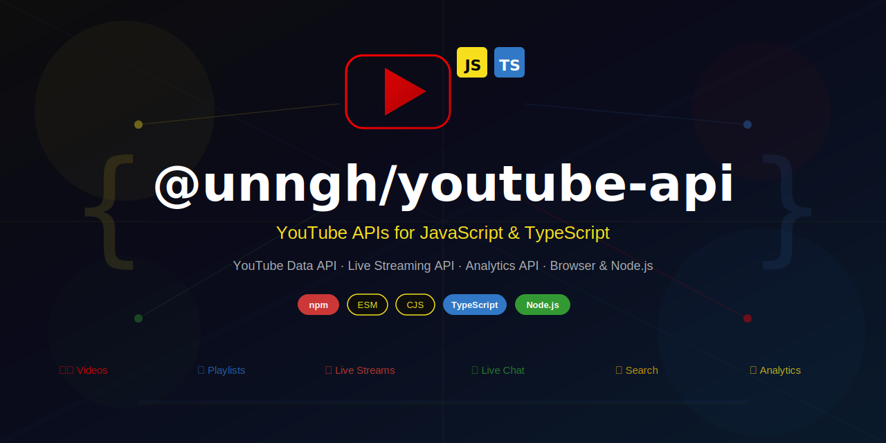

# @unngh/youtube-api

JavaScript/TypeScript bindings for the [yt](https://pub.dev/packages/yt) Dart package — YouTube Data, Live Streaming, and Analytics APIs for browser and Node.js.

[](https://www.npmjs.com/package/@unngh/youtube-api)
[](https://opensource.org/licenses/MIT)

## Table of Contents

- [Quick Start](#quick-start)
- [Features](#features)
- [API Reference](#api-reference)
- [Why yt-js?](#why-unnghyoutube-api)
- [Build Process](#build-process)
- [Publishing](#publishing)
- [Configuration](#configuration)
- [Documentation](#documentation)
- [Contributing](#contributing)
- [License](#license)

## Quick Start

### Installation

```bash
npm install @unngh/youtube-api
```

### Usage

#### Basic Usage (API Key)

```typescript
import { Yt } from '@unngh/youtube-api';

// Initialize with API key (read-only public data)
const yt = await Yt.withApiKey('YOUR_API_KEY');

// Search for videos
const searchResponse = await yt.search.list(q: 'Dart programming');

// List videos by ID
const videosResponse = await yt.videos.list(id: 'VIDEO_ID_1,VIDEO_ID_2');
```

#### OAuth2 Authentication (Live Streaming & User Operations)

Some APIs require OAuth2 authentication with appropriate scopes:
- **Live Streaming API** (broadcasts, streams, live chat)
- **Activities API** (channel activity feeds)
- **Analytics API** (detailed reports)
- **User-specific operations** (upload videos, manage playlists, moderate comments)

##### Step 1: Obtain OAuth2 Credentials

Before you can use OAuth2, you need to set up credentials in Google Cloud Console:

**1. Create a Google Cloud Project**
   - Open the [Google Cloud Console](https://console.cloud.google.com/)
   - Create a new project (e.g., "YouTube Backend Integration")

**2. Enable Required YouTube APIs**
   - Navigate to **API & Services > Library**
   - Enable these three APIs:
     - **YouTube Data API v3**
     - **YouTube Live Streaming API**
     - **YouTube Analytics API**

**3. Configure OAuth Consent Screen**
   - Go to **API & Services > OAuth consent screen**
   - Select **External** (or Enterprise if using Google Workspace)
   - Fill in: App name, User support email, Developer contact information
   - **Skip** the Scopes page (click Save and Continue)
   - **Critical:** On the **Test Users** page, click **+ Add Users** and add your Google account email
   
   > ⚠️ **Important:** If you skip adding yourself as a Test User, Google will block authentication with: *"Access blocked: This app's request is invalid"*

**4. Generate Web Application Credentials**
   - Go to **API & Services > Credentials**
   - Click **+ Create Credentials > OAuth client ID**
   - Set **Application type** to **Web application**
   - Add Authorized redirect URI: `http://localhost:8080/callback`
   - Click **Create**

**5. Download the Credentials File**
   - Find your new OAuth client ID in the list
   - Click the **Download JSON** icon (downward arrow)
   - Save the file as `client_secret.json`

##### Step 2: Set Up OAuth Credentials for @unngh/youtube-api

The `Yt.withOAuth()` method requires credential files to be present on your system. Set them up as follows:

**A. Place credential files in your project**

By default, `Yt.withOAuth()` looks for credential files in the **current working directory**:

- `client_secret.json` — the OAuth client secret you downloaded from Google Cloud Console
- `access_tokens.json` — the access/refresh tokens generated after authorization

```bash
# Place both files in your project root (where your app runs)
cp /path/to/client_secret.json ./client_secret.json
```

> **Customizing the credentials location:** If you prefer to store credentials elsewhere, you can override either file independently by setting these environment variables to the **exact file path** you want to use:
> 
> | Variable | Default |
> |----------|---------|
> | `YT_CLIENT_SECRETS_FILE` | `./client_secret.json` |
> | `YT_ACCESS_TOKENS_FILE`  | `./access_tokens.json` |
> 
> Each variable is resolved in this order:
> 
> 1. **Runtime environment**: `export YT_CLIENT_SECRETS_FILE=/path/to/client_secret.json`
> 2. **`.env` file**: Create a `.env` file in your project root containing the variable.
> 
> A leading `~` is expanded against your home directory. Either variable may be set independently — unset variables keep their default location. Example `.env`:
> 
> ```bash
> YT_CLIENT_SECRETS_FILE=~/.yt/client_secret.json
> YT_ACCESS_TOKENS_FILE=~/.yt/access_tokens.json
> ```

**B. Complete the OAuth Authorization Flow**

You need to perform a one-time OAuth authorization to generate the `access_tokens.json` file. You have two options:

**Option 1: Use yt_cli (Recommended for ease of use)**

Use the [yt_cli](https://github.com/cdavis-code/yt_workspace/tree/main/packages/yt_cli) command-line tool to complete the OAuth flow:

**Via Homebrew (macOS/Linux — fewer dependencies):**

```bash
# Install yt_cli via Homebrew
brew tap cdavis-code/yt
brew install yt

# Run the authorization flow from your project directory
# (will use ./client_secret.json automatically and create ./access_tokens.json)
yt authorize --tokens-file access_tokens.json
```

**Via Dart pub (requires Dart SDK):**

```bash
# Install yt_cli
dart pub global activate yt_cli

# Run the authorization flow from your project directory
# (will use ./client_secret.json automatically and create ./access_tokens.json)
yt authorize --tokens-file access_tokens.json
```

> **Note:** The yt_cli package uses `youtube_server_tokens.json` as its default token filename, while the yt library (used by @unngh/youtube-api) expects `access_tokens.json`. Use the `--tokens-file` flag to write directly to the correct filename, or rename the file after authorization.

**Option 2: Manual OAuth flow (Advanced)**

If you prefer not to use yt_cli, you can implement the OAuth flow yourself using the [`googleapis_auth`](https://pub.dev/packages/googleapis_auth) Dart package:

```dart
import 'dart:io';
import 'dart:convert';
import 'package:googleapis_auth/auth_io.dart';
import 'package:http/http.dart' as http;

void main() async {
  // Load client credentials from current directory
  final credentialsFile = File('client_secret.json');
  final clientId = ClientId.fromJson(
    json.decode(credentialsFile.readAsStringSync()),
  );

  // Obtain access credentials via user consent
  final credentials = await obtainAccessCredentialsViaUserConsent(
    clientId,
    ['https://www.googleapis.com/auth/youtube.force-ssl'],
    http.Client(),
    (url) => print('Visit this URL: $url'),
  );

  // Save credentials for @unngh/youtube-api in current directory
  final credFile = File('access_tokens.json');
  credFile.writeAsStringSync(json.encode(credentials.toJson()));
  
  print('Credentials saved!');
}
```

##### Step 3: Use OAuth in Your Application

Once the credential files are in place, @unngh/youtube-api will automatically use them:

```typescript
import { Yt } from '@unngh/youtube-api/node'; // or '@unngh/youtube-api/browser'

// Initialize with OAuth (reads credentials from ~/.yt/ automatically)
const yt = await Yt.withOAuth();

// Schedule a live broadcast
const broadcast = await yt.broadcast.insert({
  snippet: {
    title: 'My Live Stream',
    description: 'Welcome to my live stream!',
    scheduledStartTime: '2025-06-01T18:00:00Z',
  },
  status: {
    privacyStatus: 'unlisted',
  },
});

// Create a stream bound to the broadcast
const stream = await yt.stream.insert({
  snippet: {
    title: 'Stream Key for My Live Stream',
  },
  cdn: {
    frameRate: '30fps',
    ingestionType: 'rtmp',
    resolution: '1080p',
  },
});

// Bind the stream to the broadcast
await yt.broadcast.bind(
  id: broadcast.id!,
  streamId: stream.id!,
);

console.log(`Broadcast scheduled: ${broadcast.id}`);
console.log(`Stream key: ${stream.cdn?.ingestionInfo?.streamName}`);
```

> **How it works:** `Yt.withOAuth()` automatically reads credentials from `./client_secret.json` and `./access_tokens.json` in the current working directory. The OAuth library handles token refresh transparently, so you don't need to manage token expiration manually.

#### Browser-Based OAuth (Interactive User Authentication)

For browser applications, @unngh/youtube-api supports interactive OAuth where users authenticate directly with their Google account — no pre-stored credentials or server tokens required. This uses Google's OAuth 2.0 flow via browser popups or redirects.

```typescript
import { Yt } from '@unngh/youtube-api/browser';

// In the browser, withOAuth() triggers Google's OAuth popup/redirect flow.
// The user signs in with their Google account and grants permissions.
const yt = await Yt.withOAuth({
  logLevel: 'debug', // Optional: 'all' | 'debug' | 'info' | 'warning' | 'error'
});

// Access the authenticated user's YouTube data
const channels = await yt.channelsList({
  part: 'snippet,contentDetails',
});

console.log(`Authenticated as: ${channels.items[0].snippet?.title}`);

// Upload a video, manage playlists, moderate comments, etc.
const playlists = await yt.playlistsList({
  part: 'snippet,contentDetails',
});

console.log(`User has ${playlists.items.length} playlists`);
```

> **How it works:** In the browser, `Yt.withOAuth()` calls Google's OAuth 2.0 flow using `googleapis_auth`'s browser client. The user is prompted to sign in and grant permissions via a popup or redirect (depending on Google's configuration). After authorization, tokens are managed in-memory for the session — no files are written to disk. Each new browser session requires re-authentication, which is ideal for interactive web apps where users sign in with their own accounts.

> **Google Cloud Console setup:** Your OAuth client must have **Authorized JavaScript origins** and **Authorized redirect URIs** configured for your web app's domain (e.g., `http://localhost:3000` for development). Go to **API & Services > Credentials > OAuth 2.0 Client IDs** and add your app's URLs.

### Environment-Specific Imports

| Import path | Environment |
|-------------|-------------|
| `@unngh/youtube-api` | Auto-detected (default) |
| `@unngh/youtube-api/browser` | Browser only |
| `@unngh/youtube-api/node` | Node.js only |

## Features

- **YouTube Data API v3** — Search, Channels, Videos, Playlists, PlaylistItems, Comments, CommentThreads, Subscriptions, VideoCategories, Thumbnails, Watermarks, VideoAbuseReportReasons
- **YouTube Live Streaming API** — Broadcasts (CRUD + bind/transition), LiveStreams (CRUD), Live Chat messages
- **YouTube Members API** — Channel members, Memberships levels
- **YouTube Activities API** — Channel activity feeds with date/region filtering
- **YouTube Analytics API** — Reports query, Analytics groups & group items (CRUD)
- **Universal runtime** — Works in both browser and Node.js (ESM and CJS)
- **Type-safe** — Compiled from Dart with built-in TypeScript definitions
- **Zero dependencies** — Self-contained dart2js bundle

## API Reference

### Search

| Method | Description | Key Parameters |
|--------|-------------|----------------|
| `searchList()` | Search for videos, channels, and playlists | `q`, `part`, `type`, `maxResults` |

### Channels

| Method | Description | Key Parameters |
|--------|-------------|----------------|
| `channelsList()` | List channels by ID or username | `part`, `id`, `forUsername`, `maxResults` |

### Videos

| Method | Description | Key Parameters |
|--------|-------------|----------------|
| `videosList()` | List videos by ID or chart | `id`, `chart`, `part`, `maxResults` |

### Playlists

| Method | Description | Key Parameters |
|--------|-------------|----------------|
| `playlistsList()` | List playlists by channel or ID | `channelId`, `id`, `part`, `maxResults` |

### PlaylistItems

| Method | Description | Key Parameters |
|--------|-------------|----------------|
| `playlistItemsList()` | List items in a playlist | `playlistId`, `id`, `part`, `maxResults`, `pageToken` |
| `playlistItemsInsert()` | Add an item to a playlist | `part`, `body` |
| `playlistItemsUpdate()` | Update a playlist item | `part`, `body` |
| `playlistItemsDelete()` | Remove an item from a playlist | `id` |

### Activities

| Method | Description | Key Parameters |
|--------|-------------|----------------|
| `activitiesList()` | List channel activity feeds | `channelId`, `mine`, `part`, `maxResults`, `pageToken`, `publishedAfter`, `publishedBefore`, `regionCode` |

### Broadcasts

| Method | Description | Key Parameters |
|--------|-------------|----------------|
| `broadcastList()` | List live broadcasts | `part`, `broadcastStatus`, `broadcastType`, `id`, `maxResults` |
| `broadcastInsert()` | Create a live broadcast | `part`, `body` |
| `broadcastUpdate()` | Update a live broadcast | `part`, `body` |
| `broadcastDelete()` | Delete a live broadcast | `id` |
| `broadcastTransition()` | Transition broadcast to a new status | `id`, `broadcastStatus`, `part` |
| `broadcastBind()` | Bind a broadcast to a stream | `id`, `part`, `streamId` |

### LiveStreams

| Method | Description | Key Parameters |
|--------|-------------|----------------|
| `streamList()` | List live streams | `part`, `id`, `mine`, `maxResults`, `pageToken` |
| `streamInsert()` | Create a live stream | `part`, `body` |
| `streamUpdate()` | Update a live stream | `part`, `body` |
| `streamDelete()` | Delete a live stream | `id` |

### Chat

| Method | Description | Key Parameters |
|--------|-------------|----------------|
| `chatListMessages()` | List live chat messages | `liveChatId`, `part`, `maxResults`, `pageToken` |
| `chatInsertMessage()` | Send a live chat message | `part`, `body` |

### Comments

| Method | Description | Key Parameters |
|--------|-------------|----------------|
| `commentsList()` | List comments | `part`, `id`, `parentId` |
| `commentsListByIds()` | List comments by multiple IDs | `ids`, `maxResults`, `pageToken`, `textFormat` |
| `commentsListById()` | Get a single comment by ID | `id`, `textFormat` |
| `commentsInsert()` | Post a comment | `part`, `body` |
| `commentsUpdate()` | Update a comment | `part`, `body` |
| `commentsDelete()` | Delete a comment | `id` |
| `commentsSetModerationStatus()` | Set comment moderation status | `id`, `moderationStatus`, `banAuthor` |

### CommentThreads

| Method | Description | Key Parameters |
|--------|-------------|----------------|
| `commentThreadsList()` | List comment threads | `part`, `videoId`, `channelId`, `id`, `maxResults`, `pageToken`, `order` |
| `commentThreadsListById()` | Get a single comment thread by ID | `id`, `part` |
| `commentThreadsInsert()` | Create a new comment thread | `part`, `body` |

### Subscriptions

| Method | Description | Key Parameters |
|--------|-------------|----------------|
| `subscriptionsList()` | List subscriptions | `part`, `channelId`, `mine`, `maxResults`, `pageToken` |
| `subscriptionsInsert()` | Subscribe to a channel | `part`, `body` |
| `subscriptionsDelete()` | Unsubscribe from a channel | `id` |

### Thumbnails

| Method | Description | Key Parameters |
|--------|-------------|----------------|
| `thumbnailsSet()` | Set a custom video thumbnail | `videoId`, `filePath` |

### Watermarks

| Method | Description | Key Parameters |
|--------|-------------|----------------|
| `watermarksSet()` | Set a channel watermark | `channelId`, `body` |
| `watermarksUnset()` | Remove a channel watermark | `channelId` |

### VideoCategories

| Method | Description | Key Parameters |
|--------|-------------|----------------|
| `videoCategoriesList()` | List video categories | `part`, `id`, `regionCode`, `hl` |

### Members

| Method | Description | Key Parameters |
|--------|-------------|----------------|
| `membersList()` | List channel members | `part`, `mode`, `maxResults`, `pageToken` |

### MembershipsLevels

| Method | Description | Key Parameters |
|--------|-------------|----------------|
| `membershipsLevelsList()` | List membership levels for a channel | `part` |

### VideoAbuseReportReasons

| Method | Description | Key Parameters |
|--------|-------------|----------------|
| `videoAbuseReportReasonsList()` | List video abuse report reasons | `part`, `hl` |

### Analytics

| Method | Description | Key Parameters |
|--------|-------------|----------------|
| `analyticsQuery()` | Query YouTube Analytics report data | `ids`, `startDate`, `endDate`, `metrics`, `dimensions`, `filters`, `sort`, `maxResults`, `startIndex`, `currency`, `includeHistoricalChannelData` |
| `analyticsGroupsList()` | List analytics groups | `id`, `mine`, `pageToken`, `onBehalfOfContentOwner` |
| `analyticsGroupsInsert()` | Create an analytics group | `body`, `onBehalfOfContentOwner` |
| `analyticsGroupsUpdate()` | Update an analytics group | `body`, `onBehalfOfContentOwner` |
| `analyticsGroupsDelete()` | Delete an analytics group | `id`, `onBehalfOfContentOwner` |
| `analyticsGroupItemsList()` | List items in an analytics group | `groupId`, `id`, `pageToken`, `onBehalfOfContentOwner` |
| `analyticsGroupItemsInsert()` | Add an item to an analytics group | `body`, `onBehalfOfContentOwner` |
| `analyticsGroupItemsDelete()` | Remove an item from an analytics group | `id`, `onBehalfOfContentOwner` |

## Why @unngh/youtube-api?

| Feature | @unngh/youtube-api | simple-youtube-api |
|---------|-------------|-------------------|
| **API Coverage** | YouTube Data, Live Streaming, Analytics, Activities | YouTube Data API only |
| **Platform Support** | ✅ Browser + Node.js | ❌ Node.js only (`node-fetch`) |
| **TypeScript** | ✅ Built-in types (compiled from Dart) | ❌ No types or `@types` package |
| **Module Format** | ✅ ESM + CJS with dual entrypoints | CJS only (`main: src/index.js`) |
| **Environment Imports** | ✅ Auto / `@unngh/youtube-api/browser` / `@unngh/youtube-api/node` | Single entrypoint |
| **Maintenance** | ✅ Actively maintained | ❌ Last published 7 years ago (v5.2.1) |
| **Dependencies** | Zero runtime deps (self-contained Dart-compiled bundle) | `node-fetch`, `iso8601-duration` |
| **Build Pipeline** | dart2js (O4) + tsup | Webpack |
| **Shared Core** | ✅ Same logic as Dart SDK, CLI, and MCP packages | Standalone implementation |
| **Live Streaming** | ✅ Broadcasts, streams, live chat | ❌ Not supported |
| **Analytics** | ✅ YouTube Analytics API | ❌ Not supported |
| **Activities** | ✅ Channel activity feeds | ❌ Not supported |

### Key Advantages

🎯 **Full API Surface** — Covers Data, Live Streaming, Analytics, and Activities APIs in a single package. No need to cobble together multiple libraries.

🌍 **Universal Runtime** — One package works everywhere: Node.js 18+, modern browsers, and bundlers (Webpack, Vite, Rollup) with separate browser and Node.js builds.

🔒 **Type Safety** — Compiled from the typed [yt](https://pub.dev/packages/yt) Dart SDK, providing built-in TypeScript definitions with full IntelliSense support.

🔗 **Shared Protocol Core** — The same battle-tested codebase powers the Dart package, CLI tools, and MCP server — bug fixes and new features ship everywhere at once.

📦 **Zero Dependencies** — Self-contained dart2js bundle means no transitive dependency issues, smaller `node_modules`, and no supply-chain risk from third-party packages.

## Build Process

The build pipeline compiles Dart source to JavaScript in two stages:

1. **dart2js** — compiles `yt` Dart library to JS with O4 optimization
2. **tsup** — bundles the output with TypeScript wrappers into ESM and CJS formats

```bash
# Full build (dart2js + tsup)
npm run build

# Individual stages
npm run build:dart    # dart2js only
npm run build:ts      # tsup only

# Run tests
npm test
```

## Publishing

Releases to npm are handled automatically via GitHub Actions (`dart.yml`).

| Trigger | Behavior |
|---------|----------|
| Push to `main` that changes `packages/yt/lib/**` | Auto-bumps patch version and publishes |
| Push a `youtube-api-v*` tag | Builds and publishes the current version |

Manual release via tag:

```bash
git tag youtube-api-v2.3.0
git push origin youtube-api-v2.3.0
```

## Configuration

YouTube API access requires either an API key (read-only) or OAuth 2.0 credentials.

| Action Type | Authentication Requirement | Why |
|---|---|---|
| Reading Public Data | API Key or OAuth 2.0 | Accesses data anyone can see (e.g., public video titles, search results). |
| Reading Private Data | OAuth 2.0 Required | Accesses data specific to a user (e.g., a user's private videos or watch history). |
| Writing/Modifying Data | OAuth 2.0 Required | Performs actions on behalf of a user (e.g., uploading, deleting, or commenting). |

## Documentation

- [yt Dart package](https://pub.dev/packages/yt) — core library documentation
- [YouTube Data API](https://developers.google.com/youtube/v3/docs)
- [YouTube Live Streaming API](https://developers.google.com/youtube/v3/live/docs)
- [Repository](https://github.com/cdavis-code/yt_workspace/tree/main/packages/yt_js)

## Contributing

Any help from the open-source community is always welcome:

- Found an issue? Please file a bug report with details.
- Need a feature? Open a feature request with use cases.
- Are you a developer? Fix a bug and send a pull request.

## License

MIT License — see [LICENSE](../yt/LICENSE) for details.
